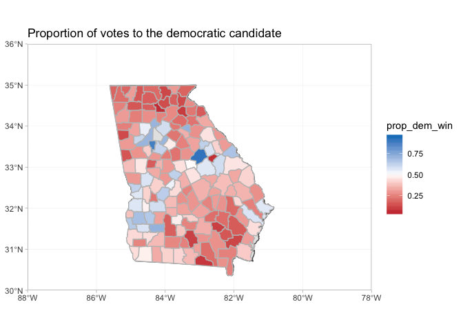

2018 Midterms Analysis
================

# Analyzing 2020 Campaign Strategy in Georgia

Context: Since 1972, Georgia has been a reliably red state in federal
and state elections. Though they voted for Carter (a native Georgia),
Georgia has consistently voted for Republican presidential candidates,
sending Reagan, both Bush’s, and Trump to the White House.

In 2016, Georgia was thought to be competitive in the presidential
election. Clinton spent surprising time attempting to win the state, but
ultimately lost it by about 4.5% - closer than either Obama election,
but still a significant margin. In 2018, star gubernatorial candidate
Stacey Abrams was narrowly defeated (in legal terms - she did not
concede the election) by 1.4%, amid rampant claims of voter surpression
by Kemp’s office (at the time, he was the Secretary of State and oversaw
his own election). Abrams closed this gap through a massive voter
outreach operation, registering 200,000 new voters over 4 years.

As a candidate, there are two mutually-exclusive groups critical to win
support from in an election 1. Undecided “likely voters”: These are
generally individuals who have previously voted. By changing the minds
of undecided voters, or voters expected to vote with those of the other
party) inc 2. “New Voters”: These are individuals who are not considered
“likely” to vote (by traditional pollster standards), and thus require
proactive engagement to encourage
    voting.

# Data and Library Management

## Libraries and Parameters

``` r
library(tidyverse)
```

    ## ── Attaching packages ─────────────────────────────────────── tidyverse 1.2.1 ──

    ## ✔ ggplot2 3.1.1       ✔ purrr   0.3.2  
    ## ✔ tibble  2.1.1       ✔ dplyr   0.8.0.1
    ## ✔ tidyr   0.8.3       ✔ stringr 1.4.0  
    ## ✔ readr   1.3.1       ✔ forcats 0.4.0

    ## ── Conflicts ────────────────────────────────────────── tidyverse_conflicts() ──
    ## ✖ dplyr::filter() masks stats::filter()
    ## ✖ dplyr::lag()    masks stats::lag()

``` r
library(readxl)
library(sf)
```

    ## Linking to GEOS 3.6.1, GDAL 2.1.3, PROJ 4.9.3

``` r
library(maps)
```

    ## 
    ## Attaching package: 'maps'

    ## The following object is masked from 'package:purrr':
    ## 
    ##     map

``` r
library(rnaturalearth)
library(USAboundaries)

context_file <- "~/CS109/election-context-2018.csv"

georgia_file <- "~/CS109/Georgia.xlsx"

florida_file <- "~/CS109/Florida.xlsx"

ohio_file <- "~/CS109/Ohio.xlsx"

georgia_population <- 10099320L

num_counties <- 159L
```

## Loading files

``` r
context <- read_csv(context_file)
```

    ## Parsed with column specification:
    ## cols(
    ##   .default = col_double(),
    ##   state = col_character(),
    ##   county = col_character()
    ## )

    ## See spec(...) for full column specifications.

``` r
georgia <- read_xlsx(georgia_file, sheet = 3, skip = 2)
florida <- read_xlsx(florida_file)
ohio <- read_excel(ohio_file, sheet = 4, skip = 4, col_names = FALSE)
```

    ## New names:
    ## * `` -> ...1
    ## * `` -> ...2
    ## * `` -> ...3
    ## * `` -> ...4
    ## * `` -> ...5
    ## * … and 48 more problems

# Wrangling Data

## Modified Data Set: Georgia-specific details

``` r
#add columns that are modifications/combinations of previous columns for easier future use.
georgia_fixed <-
  georgia %>% 
  rename(county = County, total_2018 = Total) %>% 
  left_join(context, by = "county") %>%
  filter(state == "Georgia") %>% 
  mutate(
    county = str_to_lower(county),
    vote_pct_2018 = total_2018 / total_population,
    abrams_pct = Abrams_Votes / total_2018,
    kemp_pct = Kemp_Votes / total_2018,
    total_2016 = trump16 + clinton16 + otherpres16,
    total_2012 = obama12 + romney12 + otherpres12,
    clinton_pct = clinton16 / total_2016,
    trump_pct = trump16 / total_2016,
    obama_pct = obama12 / total_2012, 
    romney_pct = romney12 / total_2012,
    abrams_gain = abrams_pct - clinton_pct,
    vote_pct_2016 = total_2016 / total_population, 
    vote_pct_2012 = total_2012 / total_population, 
    avg_dem_pct = (clinton_pct + obama_pct + abrams_pct) / 3,
    sd_dem_pct = sqrt(((clinton_pct - avg_dem_pct)^2 + (obama_pct - avg_dem_pct)^2 + (abrams_pct - avg_dem_pct)^2) / 3),
    avg_rep_pct = (kemp_pct + trump_pct + romney_pct) / 3,
    sd_rep_pct = sqrt(((kemp_pct - avg_rep_pct)^2 + (trump_pct - avg_rep_pct)^2 + (romney_pct - avg_rep_pct)^2) / 3)
  ) 
```

# Central Model 1: Modeling the Voting Behavior of LIKELY VOTERS

## Model the true percentage of democratic voters and republican voters in the county

``` r
## Here, I use a Beta distribution to estimate the actual percentage of democratic and republican voters in the county. Beta is useful here because we have previous rates of success (the number of democratic  and republican voters in the 2012 and 2016 elections) which can be used as the prior betas. We then update our prior belief with vote counts from the 2018 election. I have elected to triple the weight of the 2018 election, given reports that Stacey Abram's strategies energized democratic voters to the extent that many have moved into the category of "likely voters". 

#every time this runs, it generates a different value for the posterior because it is a random variable.
county_party_model <-
  georgia_fixed %>%
  dplyr::select(county, starts_with("vote_pct"), Kemp_Votes, Abrams_Votes, total_population, ends_with("16"), ends_with("12"), ends_with("pct"), starts_with("total")) %>% 
  mutate(
    prior_dem_count = clinton16 + obama12,
    prior_rep_b_count = trump16 + otherpres16 + romney12 + otherpres12,
    prior_rep_count = trump16 + romney12,
    prior_dem_b_count = clinton16 + otherpres16 + obama12 + otherpres12,
  ) %>% 
  mutate(
    prior_dem = rbeta(n = num_counties, shape1 = prior_dem_count, shape2 = prior_rep_b_count), #setting n = num_counties, it runs the beta distribution for every row
    prior_rep = rbeta(n = num_counties, shape1 = prior_rep_count, shape2 = prior_dem_b_count),
    post_dem = rbeta(n = num_counties, shape1 = prior_dem_count + Abrams_Votes * 6, shape2 = prior_rep_b_count + Kemp_Votes * 6),
    post_rep = rbeta(n = num_counties, shape1 = prior_rep_count + Kemp_Votes * 2, shape2 = prior_dem_b_count + Abrams_Votes * 2)
    #estimated_dem_pct = rbeta(n = num_counties, shape1 = , sd = sd_dem_pct),
    # estimated_rep_pct = rnorm(n = num_counties, mean = kemp_pct, sd = sd_rep_pct)
    # equal_props_2016_dem = clinton_pct * total_population, 
    # equal_props_2016_rep = total_population - equal_props_2016_dem,
    # equal_props_2012_dem = obama_pct * total_population, 
    # equal_props_2012_rep = total_population - equal_props_2012_dem,
  ) %>% 
  dplyr::select(starts_with("prior"), starts_with("post"), everything())
```

## Model the voter turnout rate for each county in the upcoming election

``` r
#Similarly, we model voter turnout by county using a beta distribution. We utilize historical data on voter turnout (the average of clinton and obama) as our prior, and the weight by three turnout in the 2018 election, given that it was historically different than past elections and indicative of future voting trends in Georgia.

# 
# county_likely_turnout_model <-
#   county_party_model %>% 
#   mutate(
#     estimated_turnout = rnorm(num_counties, vote_pct_2018 prob = )
#   ) %>% 
#     dplyr::select(starts_with("prior"), starts_with("post"), everything())

# I think this needs to change... its not really a beta function. 
# county_likely_turnout_model <-
#   county_party_model %>% 
#   mutate(
#     prior_turnout_count = total_2012 + total_2016,
#     prior_turnout = rbeta(n = num_counties, shape1 = prior_turnout_count / 2000, shape2 = total_population / 2000 *  2 - prior_turnout_count / 2000),
#     post_turnout = rbeta(n = num_counties, shape1 = prior_turnout_count / 2000 + total_2018 / 1000, shape2 = total_population / 2000 * 2 + total_population / 1000 - (prior_turnout_count / 2000 + total_2018 / 1000))
#   ) %>% 
#     dplyr::select(starts_with("prior"), starts_with("post"), everything())
```

## Model the actual number of likely democratic and republican voters in each county, based on the estimate of the true prop of democratic voters, true prop of republican voters, and voter turnout rate.

``` r
#This siumulates making an estimate of the actual numbers of democrats and republicans that will actually vote in an election. To do this, we use a binomial function. Our n for each county is the expected number of actual voters (multiplying the total population of the county by the expected voter turnout rate, rounded to the nearest integer). Our probability of success is our estimate of the true democratic rate.


estimated_likely_votes_2020 <-
  county_party_model %>% 
  ## can add stuff here altering the probabilities within counties
  mutate(
    estimated_dem_votes = rbinom(num_counties, total_2018, prob = post_dem),
    estimated_rep_votes = rbinom(num_counties, total_2018, prob = post_rep)
  ) %>% 
  select(starts_with("estimate"), everything())
```

# Central Model 2: Bringing in NEW VOTERS

## Reaching new voters

``` r
# This is a bit trickier to model, as it requires much more input behind the strategy for increasing voters (just sending people out into the wild tends to be ineffective)


# these are percentage constants. If a county has more than this percentage of stated category, it will be included in the models that refer to it.
high_blk_cutoff <- 50 # engage in voter outreach efforts in counties that are majority black
high_hsp_cutoff <- 15
high_nwht_cutoff <- 60
high_foreign_cutoff <- 16 
high_29u_cutoff <- 43
high_nohs_cutoff <- 15

cost_pp <- 80 #cost to speak to one user

#estimated parameters of the model for the conversion rate (a conditional probability)
mean_conversion_rate <- .3
sd_conversion_rate <- .05

#conversion rate is the conditional probability, given that a potential new voter you find is open to voting democratic, will actually vote democratic in the election (your efficacy of ) 
conversion_rate <- max(rnorm(1, mean_conversion_rate, sd_conversion_rate), .2) 
ideal_new_reach_pct <- .6 # percentage of unreached voters you would like to talk to in your selected counties

#function to calculate cost of reaching the number of people reached under a specific outreach strategy. 
cost_of_outreach <- function(number_reached) {
  c1 = 5 # cost per person of reaching 1-10000 person in a campaign
  c2 = 7 # cost per person of reaching 10001-50000 person in a campaign
  c3 = 11 # cost per person of reaching 50001-100000 person in a campaign
  c4 = 16 # cost per person of reaching 1000001 or more
  if (number_reached < 10001) {
    return(number_reached * c1)
  } else if (number_reached < 50001) {
    return(10000 * c1 + (number_reached - 10000) * c2)
  } else {
    return(10000 * c1 + (number_reached - 10000) * c2 + (number_reached - 100000) * c3)
  }
}


new_voters_added <-
  georgia_fixed %>% 
  mutate(
    unreached_pct = (total_population - total_2018) / total_population,
    likelihood_interest = abrams_pct + (1 - abrams_pct) * .5,
    unreached = total_population - total_2018,
    # we model the number of people that you are actually able to reach when canvassing as a binomial - sometimes you will reach mroe families than expected, sometimes less; it depends.
    number_reached = rbinom(num_counties, unreached, prob = ideal_new_reach_pct), 
    high_blk_pct = if_else(black_pct > high_blk_cutoff, TRUE, FALSE),
    high_hsp_pct = if_else(hispanic_pct > high_hsp_cutoff, TRUE, FALSE),
    high_nwht_pct = if_else(nonwhite_pct > high_nwht_cutoff, TRUE, FALSE),
    high_foreign_pct = if_else(foreignborn_pct > high_foreign_cutoff, TRUE, FALSE),
    high_29u_pct = if_else(age29andunder_pct > high_29u_cutoff, TRUE, FALSE),
    high_nohs_pct = if_else(lesshs_pct > high_nohs_cutoff, TRUE, FALSE)
  ) %>% 
  mutate(
    new_black = if_else(high_blk_pct, round(number_reached * likelihood_interest  * conversion_rate), 0),
    reached_black = if_else(high_blk_pct, number_reached, 0L),
    new_hsp = if_else(high_hsp_pct, round(number_reached * likelihood_interest  * conversion_rate), 0),
    reached_hsp = if_else(high_hsp_pct, number_reached , 0L),
    new_nwht = if_else(high_nwht_pct, round(number_reached * likelihood_interest  * conversion_rate), 0),
    reached_nwht = if_else(high_nwht_pct, number_reached , 0L),
    new_foreign = if_else(high_foreign_pct, round(number_reached * likelihood_interest  * conversion_rate), 0),
    reached_foreign = if_else(high_foreign_pct, number_reached, 0L),
    new_29u = if_else(high_29u_pct, round(number_reached * likelihood_interest  * conversion_rate), 0),
    reached_29u = if_else(high_29u_pct, number_reached, 0L),
    new_nohs = if_else(high_nohs_pct, round(number_reached * likelihood_interest  * conversion_rate), 0),
    reached_nohs = if_else(high_nohs_pct, number_reached, 0L),
  ) %>% 
  select(starts_with("new"), starts_with("reached"), starts_with("high"), number_reached,  everything())
```

``` r
total_reached_group <-
  new_voters_added %>% 
  summarise_at(vars(starts_with("reached")), sum) %>% 
  gather(key = "temp_name2", value = "num_reached") %>% 
  separate(temp_name2, into = c("remove_this", "demographic")) %>% 
  dplyr::select(-remove_this)
  

  

total_new_dem_voters <-
  new_voters_added %>% 
  summarise_at(vars(starts_with("new")), sum) %>% 
  gather(key = "temp_name", value = "num_converted") %>% 
  separate(temp_name, into = c("remove_this", "demographic")) %>%
  dplyr::select(-remove_this) %>% 
  left_join(total_reached_group, by = "demographic") %>% 
  mutate(
    cost = cost_of_outreach(num_reached),
    cost_per_conversion = cost/num_converted
  )
```

    ## Warning in if (number_reached < 10001) {: the condition has length > 1 and
    ## only the first element will be used

    ## Warning in if (number_reached < 50001) {: the condition has length > 1 and
    ## only the first element will be used

``` r
total_new_dem_voters
```

    ## # A tibble: 6 x 5
    ##   demographic num_converted num_reached     cost cost_per_conversion
    ##   <chr>               <dbl>       <int>    <dbl>               <dbl>
    ## 1 black              130739      581906  9354308                71.5
    ## 2 hsp                 92007      490856  7715408                83.9
    ## 3 nwht               134517      597916  9642488                71.7
    ## 4 foreign            146302      715074 11751332                80.3
    ## 5 29u                224623     1128780 19198040                85.5
    ## 6 nohs               259111     1476879 25463822                98.3

# Adding the models

``` r
## this sums the estimated number of dem and rep votes for each county to make an estimate of the total dem and rep votes in georgia.
total_votes_party_2020 <-
  estimated_likely_votes_2020 %>% 
  summarize(
    estimated_dem_votes_total = sum(estimated_dem_votes), 
    estimated_rep_votes_total = sum(estimated_rep_votes),
  )

total_votes_party_2020
```

    ## # A tibble: 1 x 2
    ##   estimated_dem_votes_total estimated_rep_votes_total
    ##                       <int>                     <int>
    ## 1                   1881772                   2011175

``` r
#this is currently giving me variation within the scope of a few thousand votes; my sense is that voter turnout should have more variability than this. 
```

## Apply a function to estimate the average estimated total\_dem and total\_rep votes.

## Alter the initial dem/rep percentages according to different voter interventions designed in different ways (eg generic “get out the vote”, targeting increase in specific counties/communities)

``` r
## for this example, let's assume that we specifically target the five highest prop-black counties in the state, conduct extensive  

est_dem_increase <- .01

altered_county_pcts <-
  georgia_fixed %>% 
  mutate(high_blk_pct = if_else(black_pct > high_blk_cutoff, TRUE, FALSE)) %>% 
  mutate(
    adjusted_dem_pct = if_else(high_blk_pct, avg_dem_pct + .01, avg_dem_pct),
    adjusted_rep_pct = if_else(high_blk_pct, avg_rep_pct - .01, avg_rep_pct)
  )
```

# Other General Data Analysis

## County Population Proportion

``` r
georgia_key_props <-
  georgia_fixed %>% 
  select(county, starts_with("vote_pct"), ends_with("pct"), total_population) %>% 
  mutate(georgia_pop = sum(total_population)) %>% 
  group_by(county) %>% 
  summarise(
    georgia_pop_pct = total_population / georgia_pop,
    abrams_pct, 
    clinton_pct, 
    obama_pct
  )
```

## Summary Details of Data

``` r
georgia_summary <-
  georgia_fixed %>% 
  summarise(
    total_2018 = sum(total_2018),
    total_2016 = sum(total_2016),
    total_2012 = sum(total_2012),
    total_population = sum(total_population)
  )

georgia_summary
```

    ## # A tibble: 1 x 4
    ##   total_2018 total_2016 total_2012 total_population
    ##        <dbl>      <dbl>      <dbl>            <dbl>
    ## 1    3903968    4114711    3900050         10099320

``` r
georgia_fixed %>% 
  select(county, starts_with("vote_pct"), ends_with("pct"), total_population) %>% 
  mutate(
    equal_props_2018_dem = abrams_pct * total_population,
    equal_props_2018_rep = total_population - equal_props_2018_dem,
    equal_props_2016_dem = clinton_pct * total_population, 
    equal_props_2016_rep = total_population - equal_props_2016_dem,
    equal_props_2012_dem = obama_pct * total_population, 
    equal_props_2012_rep = total_population - equal_props_2012_dem,
  ) %>% 
  summarize(
    equal_props_2018_dem_total = sum(equal_props_2018_dem), 
    equal_props_2018_rep_total = sum(equal_props_2018_rep),
    equal_props_2016_dem_total = sum(equal_props_2016_dem), 
    equal_props_2016_rep_total = sum(equal_props_2016_rep),
    equal_props_2012_dem_total = sum(equal_props_2012_dem), 
    equal_props_2012_rep_total = sum(equal_props_2012_rep)
  )
```

    ## # A tibble: 1 x 6
    ##   equal_props_201… equal_props_201… equal_props_201… equal_props_201…
    ##              <dbl>            <dbl>            <dbl>            <dbl>
    ## 1         4889704.         5209616.         4610526.         5488794.
    ## # … with 2 more variables: equal_props_2012_dem_total <dbl>,
    ## #   equal_props_2012_rep_total <dbl>

## County Data Management

``` r
#world <- ne_countries(scale = "medium", returnclass = "sf")

states <- us_states(resolution = "high", states = "georgia") %>%
  st_transform(crs = 4326)

counties <- st_as_sf(map("county", plot = FALSE, fill = TRUE))
counties <- 
  subset(counties, grepl("georgia", counties$ID)) %>% 
  separate(ID, into = c("state_name", "county"), sep = ",")
counties$area <- as.numeric(st_area(counties))
```

## Plotting Datasets

``` r
georgia_plots <-
  georgia_fixed %>% 
  left_join(counties, by = "county")
```

# Visualizations

## Constants for Visualizations

``` r
NYT_DEM <- "#1A80C4"
NYT_REP <- "#CC3D41" 
```

## Abrams Relative Increase in Percentage of Vote by County

``` r
ggplot(data = states) +
  geom_sf() +
  geom_sf(data = georgia_plots, color = gray(.75), aes(fill = abrams_gain)) +
  coord_sf(xlim = c(-88, -78), ylim = c(30, 36), expand = FALSE) + 
  theme_light() + 
  scale_fill_gradient2(low = "orange", high = "blue", mid = "white", midpoint = 0, space = "Lab",
                       na.value = "grey50", guide = "colourbar", aesthetics = "fill") +
  labs(title = "Abrams relative gain over Clinton in proportion of votes won")
```

<!-- -->

## Clinton Percentage of Vote by County

``` r
ggplot(data = states) +
  geom_sf() +
  geom_sf(data = georgia_plots, color = gray(.75), aes(fill = clinton_pct)) +
  coord_sf(xlim = c(-88, -78), ylim = c(30, 36), expand = FALSE) + 
  theme_light() + 
  scale_fill_gradient2(low = NYT_REP, high = NYT_DEM, mid = "white", midpoint = .5, space = "Lab",
                       na.value = "grey50", guide = "colourbar", aesthetics = "fill") +
  labs(title = "Clinton Percentage")
```

<!-- -->

## 

``` r
ggplot(data = states) +
  geom_sf() +
  geom_sf(data = georgia_plots, color = gray(.75), aes(fill = vote_pct_2018 - vote_pct_2016)) +
  coord_sf(xlim = c(-88, -78), ylim = c(30, 36), expand = FALSE) + 
  theme_light() + 
  scale_fill_gradient2(low = "orange", high = "blue", mid = "white", midpoint = 0, space = "Lab",
                       na.value = "grey50", guide = "colourbar", aesthetics = "fill") +
  labs(title = "Voter Turnout 2018")
```

<!-- -->
