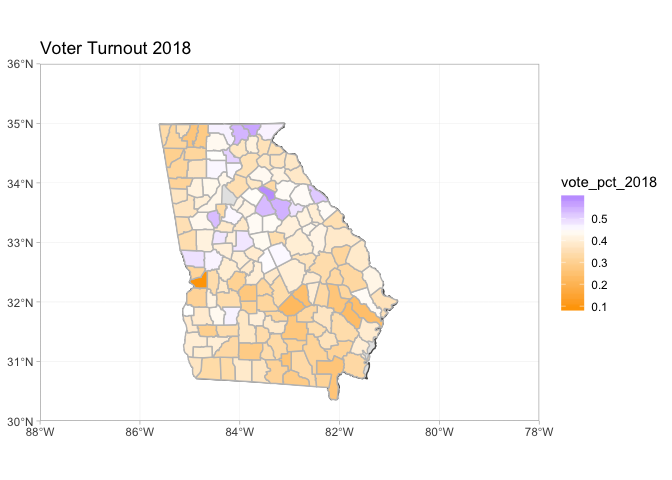

2018 Midterms Analysis
================

# Data and Library Management

## Libraries and Parameters

``` r
library(tidyverse)
```

    ## ── Attaching packages ───────────────────────────────────────────────────────────────── tidyverse 1.2.1 ──

    ## ✔ ggplot2 3.1.1       ✔ purrr   0.3.2  
    ## ✔ tibble  2.1.1       ✔ dplyr   0.8.0.1
    ## ✔ tidyr   0.8.3       ✔ stringr 1.4.0  
    ## ✔ readr   1.3.1       ✔ forcats 0.4.0

    ## ── Conflicts ──────────────────────────────────────────────────────────────────── tidyverse_conflicts() ──
    ## ✖ dplyr::filter() masks stats::filter()
    ## ✖ dplyr::lag()    masks stats::lag()

``` r
library(readxl)
library(sf)
```

    ## Linking to GEOS 3.6.1, GDAL 2.1.3, PROJ 4.9.3

``` r
library(maps)
```

    ## 
    ## Attaching package: 'maps'

    ## The following object is masked from 'package:purrr':
    ## 
    ##     map

``` r
library(rnaturalearth)
library(USAboundaries)

context_file <- "~/CS109/election-context-2018.csv"

georgia_file <- "~/CS109/Georgia.xlsx"

florida_file <- "~/CS109/Florida.xlsx"

ohio_file <- "~/CS109/Ohio.xlsx"
```

## Loading files

``` r
context <- read_csv(context_file)
```

    ## Parsed with column specification:
    ## cols(
    ##   .default = col_double(),
    ##   state = col_character(),
    ##   county = col_character()
    ## )

    ## See spec(...) for full column specifications.

``` r
georgia <- read_xlsx(georgia_file, sheet = 3, skip = 2)
florida <- read_xlsx(florida_file)
ohio <- read_excel(ohio_file, sheet = 4, skip = 4, col_names = FALSE)
```

    ## New names:
    ## * `` -> ...1
    ## * `` -> ...2
    ## * `` -> ...3
    ## * `` -> ...4
    ## * `` -> ...5
    ## * … and 48 more problems

# Wrangling Data

## Modified Data Set: Georgia-specific details

``` r
georgia_fixed <-
  georgia %>% 
  rename(county = County, total_2018 = Total) %>% 
  left_join(context, by = "county") %>%
  filter(state == "Georgia") %>% 
  mutate(
    county = str_to_lower(county),
    vote_pct_2018 = total_2018 / total_population,
    abrams_pct = Abrams_Votes / total_2018,
    total_2016 = trump16 + clinton16 + otherpres16,
    total_2012 = obama12 + romney12 + otherpres12,
    clinton_pct = clinton16 / total_2016,
    obama_pct = obama12 / total_2012, 
    abrams_gain = abrams_pct - clinton_pct,
    vote_pct_2016 = total_2016 / total_population, 
    vote_pct_2012 = total_2012 / total_population
  ) 
```

## Important Percentages

``` r
georgia_key_props <-
  georgia_fixed %>% 
  group_by(county) %>% 
  summarise()
```

## Summary Details of Data

``` r
georgia_summary <-
  georgia_fixed %>% 
  summarise(
    total_2018 = sum(total_2018),
    total_2016 = sum(total_2016),
    total_2012 = sum(total_2012)
  )

georgia_summary
```

    ## # A tibble: 1 x 3
    ##   total_2018 total_2016 total_2012
    ##        <dbl>      <dbl>      <dbl>
    ## 1    3903968    4114711    3900050

## County Data Management

``` r
#world <- ne_countries(scale = "medium", returnclass = "sf")

states <- us_states(resolution = "high", states = "georgia") %>%
  st_transform(crs = 4326)

counties <- st_as_sf(map("county", plot = FALSE, fill = TRUE))
counties <- 
  subset(counties, grepl("georgia", counties$ID)) %>% 
  separate(ID, into = c("state_name", "county"), sep = ",")
counties$area <- as.numeric(st_area(counties))
```

## Plotting Datasets

``` r
georgia_plots <-
  georgia_fixed %>% 
  left_join(counties, by = "county")
```

# Visualizations

## Constants for Visualizations

``` r
NYT_DEM <- "#1A80C4"
NYT_REP <- "#CC3D41" 
```

## Abrams Relative Increase in Percentage of Vote by County

``` r
ggplot(data = states) +
  geom_sf() +
  geom_sf(data = georgia_plots, color = gray(.75), aes(fill = abrams_gain)) +
  coord_sf(xlim = c(-88, -78), ylim = c(30, 36), expand = FALSE) + 
  theme_light() + 
  scale_fill_gradient2(low = "orange", high = "blue", mid = "white", midpoint = 0, space = "Lab",
                       na.value = "grey50", guide = "colourbar", aesthetics = "fill") +
  labs(title = "Abrams relative gain over Clinton in proportion of votes won")
```

<!-- -->

## Clinton Percentage of Vote by County

``` r
ggplot(data = states) +
  geom_sf() +
  geom_sf(data = georgia_plots, color = gray(.75), aes(fill = clinton_pct)) +
  coord_sf(xlim = c(-88, -78), ylim = c(30, 36), expand = FALSE) + 
  theme_light() + 
  scale_fill_gradient2(low = NYT_REP, high = NYT_DEM, mid = "white", midpoint = .5, space = "Lab",
                       na.value = "grey50", guide = "colourbar", aesthetics = "fill") +
  labs(title = "Clinton Percentage")
```

<!-- -->

## 

``` r
ggplot(data = states) +
  geom_sf() +
  geom_sf(data = georgia_plots, color = gray(.75), aes(fill = vote_pct_2018)) +
  coord_sf(xlim = c(-88, -78), ylim = c(30, 36), expand = FALSE) + 
  theme_light() + 
  scale_fill_gradient2(low = "orange", high = "blue", mid = "white", midpoint = .45, space = "Lab",
                       na.value = "grey50", guide = "colourbar", aesthetics = "fill") +
  labs(title = "Voter Turnout 2018")
```

<!-- -->
