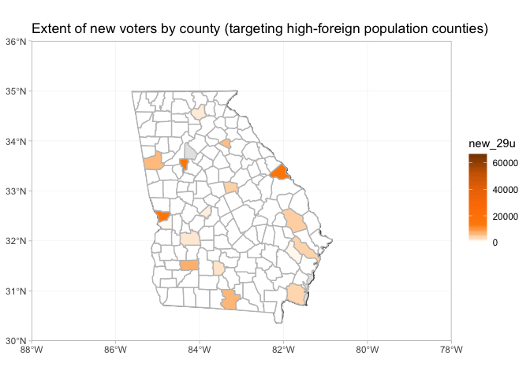

2018 Midterms Analysis
================

Vikas Maturi

# Analyzing 2020 Campaign Strategy in Georgia

Context: Since 1972, Georgia has been a reliably red state in federal
and state elections. Though they voted for Carter (a native Georgian),
Georgia has consistently voted for Republican presidential candidates,
sending Reagan, both Bush’s, and Trump to the White House.

In 2016, Georgia was thought to be competitive in the presidential
election. Clinton spent surprising time attempting to win the state, but
ultimately lost it by about 4.5% - closer than either Obama election,
but still a significant margin. In 2018, star gubernatorial candidate
Stacey Abrams was narrowly defeated (in legal terms - she did not
concede the election) by 1.4%, amid rampant claims of voter surpression
by Kemp’s office (at the time, he was the Secretary of State and oversaw
his own election). Abrams closed this gap through a massive voter
outreach operation, registering 200,000 new voters over the 4 prior
years.

As a candidate, there are two mutually-exclusive groups critical to win
support from in an election 1. “New Voters”: These are individuals who
are not considered “likely” to vote (by traditional pollster standards),
and thus require proactive engagement to encourage voting. 2. Undecided
“likely voters”: These are generally individuals who have previously
voted. By changing the minds of voters who are expected to vote with
those of the other party, or have not quite made up their mind, one can
massively improve their outcome.

I will be *only be exploring the “new voter”
approach.* My goal is to **create a template model for voter
turnout** under the “new voter” approach, and **visualize the
implications of these models**. In particular, I study how a campaign
can rely upon *historical election data* and *demographic data* alone to
estimate election results. To create my models, I rely upon historical
election data from the 2012, 2016, and 2018 election. Further, I develop
cost estimates for my models (which could be altered given more accurate
cost information). Finally, using demographic data, I visualize the
extent of voter gain under different approaches of reaching new voters,
and then visualize how this impacts the electoral map.

The primary statistical methods I explore in this project are
distributions (Beta, binomial, normal) and conditional probability. I
also developed several algorithms utilized to obtain the appropriate
inputs to the model.

Ultimately, my goal was to develop the outline of a practical tool
that can be used for political campaigns to identify approaches of
reaching more voters using publically available data. I believe it has
further potential implications in identifying areas of voter
disenfranchisement.

All data was used with permission from the 2018 MIT Election Data and
Science Lab (publicly available on
    GitHub)

# Data and Library Management

## Libraries and Parameters

``` r
library(tidyverse)
```

    ## ── Attaching packages ─────────────────────────────────────── tidyverse 1.2.1 ──

    ## ✔ ggplot2 3.1.1       ✔ purrr   0.3.2  
    ## ✔ tibble  2.1.1       ✔ dplyr   0.8.0.1
    ## ✔ tidyr   0.8.3       ✔ stringr 1.4.0  
    ## ✔ readr   1.3.1       ✔ forcats 0.4.0

    ## ── Conflicts ────────────────────────────────────────── tidyverse_conflicts() ──
    ## ✖ dplyr::filter() masks stats::filter()
    ## ✖ dplyr::lag()    masks stats::lag()

``` r
library(readxl)
library(sf)
```

    ## Linking to GEOS 3.6.1, GDAL 2.1.3, PROJ 4.9.3

``` r
library(maps)
```

    ## 
    ## Attaching package: 'maps'

    ## The following object is masked from 'package:purrr':
    ## 
    ##     map

``` r
library(rnaturalearth)
library(USAboundaries)

context_file <- "~/CS109/election-context-2018.csv"

georgia_file <- "~/CS109/Georgia.xlsx"

florida_file <- "~/CS109/Florida.xlsx"

ohio_file <- "~/CS109/Ohio.xlsx"

georgia_population <- 10099320L

num_counties <- 159L
```

## Loading files

``` r
context <- read_csv(context_file)
```

    ## Parsed with column specification:
    ## cols(
    ##   .default = col_double(),
    ##   state = col_character(),
    ##   county = col_character()
    ## )

    ## See spec(...) for full column specifications.

``` r
georgia <- read_xlsx(georgia_file, sheet = 3, skip = 2)
florida <- read_xlsx(florida_file)
ohio <- read_excel(ohio_file, sheet = 4, skip = 4, col_names = FALSE)
```

    ## New names:
    ## * `` -> ...1
    ## * `` -> ...2
    ## * `` -> ...3
    ## * `` -> ...4
    ## * `` -> ...5
    ## * … and 48 more problems

## County Data Management

``` r
world <- ne_countries(scale = "medium", returnclass = "sf")

states <- us_states(resolution = "high", states = "georgia") %>%
  st_transform(crs = 4326)

counties <- st_as_sf(map("county", plot = FALSE, fill = TRUE))
counties <- 
  subset(counties, grepl("georgia", counties$ID)) %>% 
  separate(ID, into = c("state_name", "county"), sep = ",")
counties$area <- as.numeric(st_area(counties))
```

## Constants for Visualizations

``` r
#these are colors for electoral maps
NYT_DEM <- "#1A80C4"
NYT_REP <- "#CC3D41" 
```

# Wrangling Data

## Modified Data Set: Georgia-specific details

``` r
#add columns that are modifications/combinations of previous columns for easier future use.
georgia_fixed <-
  georgia %>% 
  rename(county = County, total_2018 = Total) %>% 
  left_join(context, by = "county") %>%
  filter(state == "Georgia") %>% 
  mutate(
    county = str_to_lower(county),
    vote_pct_2018 = total_2018 / total_population,
    abrams_pct = Abrams_Votes / total_2018,
    kemp_pct = Kemp_Votes / total_2018,
    metz_pct = Metz_Votes / total_2018,
    total_2016 = trump16 + clinton16 + otherpres16,
    total_2012 = obama12 + romney12 + otherpres12,
    clinton_pct = clinton16 / total_2016,
    trump_pct = trump16 / total_2016,
    obama_pct = obama12 / total_2012, 
    romney_pct = romney12 / total_2012,
    abrams_gain = abrams_pct - clinton_pct,
    vote_pct_2016 = total_2016 / total_population, 
    vote_pct_2012 = total_2012 / total_population, 
    avg_dem_pct = (clinton_pct + obama_pct + abrams_pct) / 3,
    sd_dem_pct = sqrt(((clinton_pct - avg_dem_pct)^2 + (obama_pct - avg_dem_pct)^2 + (abrams_pct - avg_dem_pct)^2) / 3),
    avg_rep_pct = (kemp_pct + trump_pct + romney_pct) / 3,
    sd_rep_pct = sqrt(((kemp_pct - avg_rep_pct)^2 + (trump_pct - avg_rep_pct)^2 + (romney_pct - avg_rep_pct)^2) / 3)
  ) 
```

# Crafting a baseline estimate of the true percentage of LIKELY Democratic and Republican voters in a county

## Model the true percentage of democratic voters and republican voters in the county

Here, I use a Beta distribution to estimate the actual percentage of
democratic and republican voters in the county. Beta is useful here
because we have previous rates of success (the number of democratic and
republican voters in the 2012 and 2016 elections) which can be used as
the prior betas. We then update our prior belief with vote counts from
the 2018 election. I have elected to triple the weight of the 2018
election, given reports that Stacey Abram’s strategies energized
democratic voters to the extent that many have moved into the category
of “likely
voters”.

``` r
#every time this runs, it generates a different value for the posterior because it is a random variable.
county_party_prop_model <- function(georgia_fixed){
  county_party_model <-
    georgia_fixed %>%
    dplyr::select(county, starts_with("vote_pct"), Kemp_Votes, Abrams_Votes, total_population, ends_with("16"), ends_with("12"), ends_with("pct"), starts_with("total")) %>% 
    mutate(
      prior_dem_count = round(clinton16 * .5) + round(obama12 * .75),
      prior_rep_b_count = round((trump16 + otherpres16) * .5) + round((romney12 + otherpres12) * .75),
      prior_rep_count = round(trump16 * .5) + round(romney12 * .75),
      prior_dem_b_count = round((clinton16 + otherpres16) * .5) + round((obama12 + otherpres12) * .75),
    ) %>% 
    mutate(
      prior_dem = rbeta(n = num_counties, shape1 = prior_dem_count, shape2 = prior_rep_b_count), #setting n = num_counties, it runs the beta distribution for every row
      prior_rep = rbeta(n = num_counties, shape1 = prior_rep_count, shape2 = prior_dem_b_count),
      post_dem = rbeta(n = num_counties, shape1 = prior_dem_count + Abrams_Votes * 3, shape2 = prior_rep_b_count + Kemp_Votes * 3),
      post_rep = rbeta(n = num_counties, shape1 = prior_rep_count + Kemp_Votes * 3 , shape2 = prior_dem_b_count + Abrams_Votes * 3 )
      #estimated_dem_pct = rbeta(n = num_counties, shape1 = , sd = sd_dem_pct),
      # estimated_rep_pct = rnorm(n = num_counties, mean = kemp_pct, sd = sd_rep_pct)
      # equal_props_2016_dem = clinton_pct * total_population, 
      # equal_props_2016_rep = total_population - equal_props_2016_dem,
      # equal_props_2012_dem = obama_pct * total_population, 
      # equal_props_2012_rep = total_population - equal_props_2012_dem,
    ) %>% 
    dplyr::select(starts_with("prior"), starts_with("post"), everything())
  
  return(county_party_model)
}
```

## Model the actual NUMBER of likely democratic and republican voters in each county, based on the estimates of the voter turnout rate and the true proportions of democratic and republican voters

This siumulates making an estimate of the actual numbers of democrats
and republicans that will vote in an election. To do this, we use a
normal function. This normal looks to model the binomial, but I have
adjusted the variance slightly (increased) to reflect what I believe to
be a more appropriate estimate of the number of voters. (Voter behavior
has more variance than a traditional binomial).

I also include a model with the binomial function. Our n for each county
is the expected number of actual voters (multiplying the total
population of the county by the expected voter turnout rate, rounded to
the nearest integer). Our probability of success is our estimate of the
true democratic rate. For now, we are still assuming that only LIKELY
VOTERS are
voting.

``` r
#Utilizing the binomial function to make these estimations of county turnout by party, and the  end result

estimate_likely_2020 <- function(county_party_model) {
  estimated_likely_votes_2020 <- 
    county_party_model %>% 
    ## can add stuff here altering the probabilities within counties
    mutate(
      #We model the binomial as a normal, but alter the standard deviation to be the variance to intentionally increase the amount of variation in our model. We do not think the binomial is the perfect representataion of voting behavior, and that it in fact has greater variance than a binomial
      estimated_dem_votes = rnorm(num_counties, total_2018 * post_dem, (total_2018 * post_dem * (1 - post_dem))^(4/5)),
      # Modeling the rep and dem votes separately does not take into account the fact that they are highly dependent on each other for any individual county.
      estimated_rep_votes = total_2018 - estimated_dem_votes - round(metz_pct * total_2018),
      #estimated_rep_votes = rnorm(num_counties, total_2018 * post_rep, sqrt(total_2018 * post_rep * (1 - post_rep)) * 50),
      estimated_dem_votes_bin = rbinom(num_counties, total_2018, prob = post_dem),
      estimated_rep_votes_bin = total_2018 - estimated_dem_votes_bin - round(metz_pct * total_2018),
      #estimated_rep_votes_bin = rbinom(num_counties, total_2018, prob = post_rep)
    ) %>% 
    select(starts_with("estimate"), everything())
  
  return(estimated_likely_votes_2020)
  
}
estimate_likely_2020(county_party_prop_model(georgia_fixed))
```

    ## # A tibble: 159 x 62
    ##    estimated_dem_v… estimated_rep_v… estimated_dem_v… estimated_rep_v…
    ##               <dbl>            <dbl>            <int>            <dbl>
    ##  1            1289.            5494.             1411             5372
    ##  2             876.            1635.              695             1816
    ##  3             742.            3067.              506             3303
    ##  4             557.             729.              545              741
    ##  5            8384.            7136.             7784             7736
    ##  6             816.            5978.              737             6057
    ##  7            5528.           21528.             6828            20228
    ##  8            8685.           28213.             8714            28184
    ##  9            1906.            3603.             2054             3455
    ## 10             762.            5447.             1006             5203
    ## # … with 149 more rows, and 58 more variables: prior_dem_count <dbl>,
    ## #   prior_rep_b_count <dbl>, prior_rep_count <dbl>,
    ## #   prior_dem_b_count <dbl>, prior_dem <dbl>, prior_rep <dbl>,
    ## #   post_dem <dbl>, post_rep <dbl>, county <chr>, vote_pct_2018 <dbl>,
    ## #   vote_pct_2016 <dbl>, vote_pct_2012 <dbl>, Kemp_Votes <dbl>,
    ## #   Abrams_Votes <dbl>, total_population <dbl>, trump16 <dbl>,
    ## #   clinton16 <dbl>, otherpres16 <dbl>, demsen16 <dbl>, repsen16 <dbl>,
    ## #   othersen16 <dbl>, demhouse16 <dbl>, rephouse16 <dbl>,
    ## #   otherhouse16 <dbl>, demgov16 <dbl>, repgov16 <dbl>, othergov16 <dbl>,
    ## #   total_2016 <dbl>, romney12 <dbl>, obama12 <dbl>, otherpres12 <dbl>,
    ## #   total_2012 <dbl>, white_pct <dbl>, black_pct <dbl>,
    ## #   hispanic_pct <dbl>, nonwhite_pct <dbl>, foreignborn_pct <dbl>,
    ## #   female_pct <dbl>, age29andunder_pct <dbl>, age65andolder_pct <dbl>,
    ## #   clf_unemploy_pct <dbl>, lesshs_pct <dbl>, lesscollege_pct <dbl>,
    ## #   lesshs_whites_pct <dbl>, lesscollege_whites_pct <dbl>,
    ## #   rural_pct <dbl>, abrams_pct <dbl>, kemp_pct <dbl>, metz_pct <dbl>,
    ## #   clinton_pct <dbl>, trump_pct <dbl>, obama_pct <dbl>, romney_pct <dbl>,
    ## #   avg_dem_pct <dbl>, sd_dem_pct <dbl>, avg_rep_pct <dbl>,
    ## #   sd_rep_pct <dbl>, total_2018 <dbl>

``` r
# this function translates our county-based estimates of turnout for republicans and democrats to a joined table.
total_likely_model_2020 <- function(estimated_likely_votes_2020) {

total_likely_votes_2020 <-
  estimated_likely_votes_2020 %>% 
  summarize(
    estimated_dem_votes_total = sum(estimated_dem_votes), 
    estimated_rep_votes_total = sum(estimated_rep_votes),
    estimated_dem_total_bin = sum(estimated_dem_votes_bin),
    estimated_rep_total_bin = sum(estimated_rep_votes_bin)
  )

return(total_likely_votes_2020)

}
```

## Run a function to compile 1000 trials of estimated voter turnout by party by county if only LIKELY VOTERS were voting

``` r
trials_for_viz <- 10
trials <- 1000

several_likely_outcomes <- function(df) {
  total_likely_model_2020(estimate_likely_2020(county_party_prop_model(df)))
}

vec_dfs <- rep(list(georgia_fixed), trials)

test_results <-
  map_dfr(vec_dfs, several_likely_outcomes) %>%
  mutate(
    did_dem_win = if_else(estimated_dem_votes_total > estimated_rep_votes_total, TRUE, FALSE),
    did_dem_bin_win = if_else(estimated_dem_total_bin > estimated_rep_total_bin, TRUE, FALSE),
  ) %>%
  summarize_all(mean)

knitr::kable(test_results)
```

| estimated\_dem\_votes\_total | estimated\_rep\_votes\_total | estimated\_dem\_total\_bin | estimated\_rep\_total\_bin | did\_dem\_win | did\_dem\_bin\_win |
| ---------------------------: | ---------------------------: | -------------------------: | -------------------------: | ------------: | -----------------: |
|                      1874802 |                      1992285 |                    1874446 |                    1992641 |         0.001 |                  0 |

This table above reflects the MEAN estimate for republican and democrat
voters under a normal model (with high variance) and a binomial model.
We see that, according to this model, Stacey Abrams should win roughly
.3% of the time. This is much less than the expected winning percentage
of 33% according to 538 prior to the election. The reason for this is
that my model does not accurately reflect how the normal models that
represent likely-voter turnout in each county should have different
variances in each county (i.e. we might expect the variance of a largely
agrarian and republican county in rural Georgia to be virtually 0, even
if they have a large population). Moreover, we have biased our
estimation of the probability of voting democrat (post\_dem) by using
historical data through the Beta distribution, which may not account for
recent demographic shifts.

Source:
<https://projects.fivethirtyeight.com/2018-midterm-election-forecast/governor/?ex_cid=midterms-header>

## Visualization of three possible election maps if ONLY LIKELY VOTERS were voting

``` r
#this function estimates the proportion of democrats that will win in each count
test_result_df <- function(georgia_fixed) {
test_results_viz <-
  estimate_likely_2020(county_party_prop_model(georgia_fixed)) %>%
  mutate(
    did_dem_win = if_else(estimated_dem_votes > estimated_rep_votes, TRUE, FALSE),
    did_dem_bin_win = if_else(estimated_dem_votes_bin > estimated_rep_votes_bin, TRUE, FALSE),
    prop_dem_win = estimated_dem_votes / (estimated_rep_votes +  estimated_dem_votes),
    prop_rep_win = estimated_rep_votes / (estimated_rep_votes +  estimated_dem_votes)
  ) %>%
  left_join(counties, by = "county")

return(test_results_viz)

}

#this function plots the proportion of votes to the democratic candidate by county
plot_data <- function(georgia_fixed) {
ggplot(data = states) +
  geom_sf() +
  geom_sf(data = test_result_df(georgia_fixed), color = gray(.75), aes(fill = prop_dem_win)) +
  coord_sf(xlim = c(-88, -78), ylim = c(30, 36), expand = FALSE) + 
  theme_light() + 
  scale_fill_gradient2(low = NYT_REP, high = NYT_DEM, mid = "white", midpoint = .5, space = "Lab",
                       na.value = "grey50", guide = "colourbar", aesthetics = "fill", limits = c(.05, .95)) +
  labs(title = "Proportion of votes to the democratic candidate")
  
}

plot_data(georgia_fixed)
```

<!-- -->

``` r
plot_data(georgia_fixed)
```

<!-- -->

``` r
plot_data(georgia_fixed)
```

<!-- -->

Without modification, these maps look remarkably close. In all of them,
the republican wins. Assuming these are true representations of likely
votes, this validates that Democrats have a significant task ahead in
winning the Georgia election.

In order to win this election, Democrats could adopt two strategies as
previuosly discussed. I’ll be exploring the model of reaching new
voters. “New Voters”: These are individuals who are not considered
“likely” to vote (by traditional pollster standards), and thus require
proactive engagement to encourage voting.

# Central Model: Bringing in NEW VOTERS

To reiterate, my goal with this project is to rely on freely-available
demographic data to explore different strategies of targeting new
voters.

In this model, I explore seven targeting strategies. These strategies
look at targeting specific counties based on their demographic
information. They are counties with high proportion of: \* black
constituents (blk) \* hispanic constituents (hsp) \* non-white
constituents (nwht) \* foreign-born constituents (foreign) \* under-29
constituents (29u) \* no high school education constituents (nohs) \*
people who voted for Stacey Abrams in 2018 (abs)

How it works: I create cutoffs that mark the percentage of a particular
demographic a county must have in order to justify campaigning there.
For the selected counties, I make an estimate of the number of new
voters that can be brought in. This number is based on both historical
voter rates and population demographic characteristics that are closely
correlated with voter turnout, which are factored into the conversion
rate (more info in the code below). This gets me to a number of new
voters per county. Again, this is a county-based model of expanding
voters.

## Modeling the number of new likely voters and the number of voters reached

I model this number by taking the expectation of my random variable X ~
N(mean\_new\_voters, variance), where X is the number of new voters.
This ends up being just the mean component of the distribution. This is
calculated
by

``` r
# these are percentage constants. If a county has more than this percentage of stated category, it will be included in the models that refer to it.
high_blk_cutoff <- 45 # engage in voter outreach efforts in counties that are majority black
high_hsp_cutoff <- 11
high_nwht_cutoff <- 59.7
high_foreign_cutoff <- 15
high_29u_cutoff <- 43.5
high_nohs_cutoff <- 20
high_abs_cutoff <- .70

#this is an estimated base conversion rate. We will alter this value by county based on demographic realities regarding voter turnout in the code below
base_conv <- .3

ideal_new_reach_pct <- .6 # percentage of unreached voters you would like to talk to in your selected counties


get_new_voters <- function(df) {
new_voters_added <-
  georgia_fixed %>% 
  mutate(
    unreached_pct = (total_population - total_2018) / total_population,
    
    # Utilizing the proportion of democratic voters, we obtain a rough estimate of the percentage of potential new voters that may be open to a message from the democratic party (but are not classified by likely voters)
    likelihood_interest = abrams_pct + (1 - abrams_pct) * .3,
    
    #I consider non-voters in 2018 to be unlikely voters as a simplifying assumption.
    unreached = total_population - total_2018,
    
    #I calculate the estimated conversion rate by considering factors that influence an individuals ability to vote. For example, we believe even if you convince an unemployed person of your politics, they may not have the resources to vote. Thus we account for these limiting factors in the ease of difficulty for converting one person  in a given county. This is our probability of success "p" in the Bernoulli trial representing the experiment of converting one non-likely voter to a democratic voter.
    conversion_rate = base_conv * sqrt(median_hh_inc / mean(median_hh_inc)) * sqrt(mean(foreignborn_pct) / foreignborn_pct) * sqrt(mean(clf_unemploy_pct) / clf_unemploy_pct) * sqrt(mean(age29andunder_pct) / age29andunder_pct),
    
    # I model the number of people that you are actually able to reach when canvassing as a binomial for a given district (though this may be an unnecessary model)
    number_reached = rbinom(num_counties, unreached, prob = ideal_new_reach_pct), 
    high_blk_pct = if_else(black_pct > high_blk_cutoff, TRUE, FALSE),
    high_hsp_pct = if_else(hispanic_pct > high_hsp_cutoff, TRUE, FALSE),
    high_nwht_pct = if_else(nonwhite_pct > high_nwht_cutoff, TRUE, FALSE),
    high_foreign_pct = if_else(foreignborn_pct > high_foreign_cutoff, TRUE, FALSE),
    high_29u_pct = if_else(age29andunder_pct > high_29u_cutoff, TRUE, FALSE),
    high_nohs_pct = if_else(lesshs_pct > high_nohs_cutoff, TRUE, FALSE),
    high_abs_pct = if_else(abrams_pct > high_abs_cutoff, TRUE, FALSE)
  ) %>% 
  #here, we are tabulating by county the number of voters reached and the number of non-likely voters converted to voters. We also tabulate the number  of voters reached. 
  mutate(
    #this calculation 
    new_black = if_else(high_blk_pct, round(number_reached * likelihood_interest  * conversion_rate), 0),
    reached_black = if_else(high_blk_pct, number_reached, 0L),
    count_black = if_else(high_blk_pct, 1, 0),
    new_hsp = if_else(high_hsp_pct, round(number_reached * likelihood_interest  * conversion_rate), 0),
    reached_hsp = if_else(high_hsp_pct, number_reached , 0L),
    count_hsp = if_else(high_hsp_pct, 1, 0),
    new_nwht = if_else(high_nwht_pct, round(number_reached * likelihood_interest  * conversion_rate), 0),
    reached_nwht = if_else(high_nwht_pct, number_reached , 0L),
    count_nwht = if_else(high_nwht_pct, 1, 0),
    new_foreign = if_else(high_foreign_pct, round(number_reached * likelihood_interest  * conversion_rate), 0),
    reached_foreign = if_else(high_foreign_pct, number_reached, 0L), 
    count_foreign = if_else(high_foreign_pct, 1, 0),
    new_29u = if_else(high_29u_pct, round(number_reached * likelihood_interest  * conversion_rate), 0),
    reached_29u = if_else(high_29u_pct, number_reached, 0L),
    count_29u = if_else(high_29u_pct, 1, 0),
    new_nohs = if_else(high_nohs_pct, round(number_reached * likelihood_interest  * conversion_rate), 0),
    reached_nohs = if_else(high_nohs_pct, number_reached, 0L),
    count_nohs = if_else(high_nohs_pct, 1, 0),
    new_abs = if_else(high_abs_pct, round(number_reached * likelihood_interest  * conversion_rate), 0),
    reached_abs = if_else(high_abs_pct, number_reached, 0L),
    count_abs = if_else(high_abs_pct, 1, 0),
  ) %>% 
  select(starts_with("new"), starts_with("reached"), starts_with("high"), number_reached, everything())
  return(new_voters_added) 
}

knitr::kable(get_new_voters(georgia_fixed) %>% head(5))
```

| new\_black | new\_hsp | new\_nwht | new\_foreign | new\_29u | new\_nohs | new\_abs | reached\_black | reached\_hsp | reached\_nwht | reached\_foreign | reached\_29u | reached\_nohs | reached\_abs | high\_blk\_pct | high\_hsp\_pct | high\_nwht\_pct | high\_foreign\_pct | high\_29u\_pct | high\_nohs\_pct | high\_abs\_pct | number\_reached | county   | Registered\_Voters | Election\_Day\_Kemp | Absentee\_Mail\_Kemp | Advance\_Kemp | Provisional\_Kemp | Kemp\_Votes | Election\_Day\_Abrams | Absentee\_Mail\_Abrams | Advance\_Abrams | Provisional\_Abrams | Abrams\_Votes | Election\_Day\_Metz | Absentee\_Mail\_Metz | Advance\_Metz | Provisional\_Metz | Metz\_Votes | total\_2018 | state   |  fips | trump16 | clinton16 | otherpres16 | romney12 | obama12 | otherpres12 | demsen16 | repsen16 | othersen16 | demhouse16 | rephouse16 | otherhouse16 | demgov16 | repgov16 | othergov16 | repgov14 | demgov14 | othergov14 | total\_population |  cvap | white\_pct | black\_pct | hispanic\_pct | nonwhite\_pct | foreignborn\_pct | female\_pct | age29andunder\_pct | age65andolder\_pct | median\_hh\_inc | clf\_unemploy\_pct | lesshs\_pct | lesscollege\_pct | lesshs\_whites\_pct | lesscollege\_whites\_pct | rural\_pct | ruralurban\_cc | vote\_pct\_2018 | abrams\_pct | kemp\_pct | metz\_pct | total\_2016 | total\_2012 | clinton\_pct | trump\_pct | obama\_pct | romney\_pct | abrams\_gain | vote\_pct\_2016 | vote\_pct\_2012 | avg\_dem\_pct | sd\_dem\_pct | avg\_rep\_pct | sd\_rep\_pct | unreached\_pct | likelihood\_interest | unreached | conversion\_rate | count\_black | count\_hsp | count\_nwht | count\_foreign | count\_29u | count\_nohs | count\_abs |
| ---------: | -------: | --------: | -----------: | -------: | --------: | -------: | -------------: | -----------: | ------------: | ---------------: | -----------: | ------------: | -----------: | :------------- | :------------- | :-------------- | :----------------- | :------------- | :-------------- | :------------- | --------------: | :------- | -----------------: | :------------------ | :------------------- | :------------ | :---------------- | ----------: | :-------------------- | :--------------------- | :-------------- | :------------------ | ------------: | :------------------ | :------------------- | :------------ | :---------------- | ----------: | ----------: | :------ | ----: | ------: | --------: | ----------: | -------: | ------: | ----------: | -------: | -------: | ---------: | ---------: | ---------: | -----------: | -------: | -------: | ---------: | -------: | -------: | ---------: | ----------------: | ----: | ---------: | ---------: | ------------: | ------------: | ---------------: | ----------: | -----------------: | -----------------: | --------------: | -----------------: | ----------: | ---------------: | ------------------: | -----------------------: | ---------: | -------------: | --------------: | ----------: | --------: | --------: | ----------: | ----------: | -----------: | ---------: | ---------: | ----------: | -----------: | --------------: | --------------: | ------------: | -----------: | ------------: | -----------: | -------------: | -------------------: | --------: | ---------------: | -----------: | ---------: | ----------: | -------------: | ---------: | ----------: | ---------: |
|          0 |        0 |         0 |            0 |        0 |       911 |        0 |              0 |            0 |             0 |                0 |            0 |          6842 |            0 | FALSE          | FALSE          | FALSE           | FALSE              | FALSE          | TRUE            | FALSE          |            6842 | appling  |              10613 | 2334                | 357                  | 2735          | 0                 |        5426 | 630                   | 170                    | 557             | 0                   |          1357 | 14                  | 3                    | 6             | 0                 |          23 |        6806 | Georgia | 13001 |    5494 |      1434 |          84 |     5233 |    1758 |          95 |     1187 |     5170 |        154 |       1305 |       5387 |            0 |       NA |       NA |         NA |     3188 |     1124 |         92 |             18410 | 13180 |   70.00543 |   18.23466 |      9.353612 |      29.99457 |         4.378055 |    51.27105 |           38.97882 |           15.52417 |           37388 |           8.460929 |    23.62486 |         88.08210 |            19.21096 |                 86.15890 |   71.44111 |              7 |       0.3696904 |   0.1993829 | 0.7972377 | 0.0033794 |        7012 |        7086 |    0.2045066 |  0.7835140 |  0.2480948 |   0.7384984 |  \-0.0051237 |       0.3808800 |       0.3848995 |     0.2173281 |    0.0218557 |     0.7730834 |    0.0250888 |      0.6303096 |            0.4395680 |     11604 |        0.3030163 |            0 |          0 |           0 |              0 |          0 |           1 |          0 |
|          0 |      304 |         0 |            0 |        0 |       304 |        0 |              0 |         3493 |             0 |                0 |            0 |          3493 |            0 | FALSE          | TRUE           | FALSE           | FALSE              | FALSE          | TRUE            | FALSE          |            3493 | atkinson |               4252 | 808                 | 45                   | 1022          | 0                 |        1875 | 333                   | 43                     | 260             | 0                   |           636 | 6                   | 0                    | 3             | 0                 |           9 |        2520 | Georgia | 13003 |    1878 |       697 |          35 |     1938 |     930 |          34 |      596 |     1678 |         65 |        638 |       1718 |            0 |       NA |       NA |         NA |     1005 |      561 |         55 |              8268 |  5150 |   56.37397 |   17.97291 |     24.746009 |      43.62603 |        13.062409 |    48.66957 |           43.22690 |           11.46589 |           31296 |           5.914870 |    32.10516 |         93.32182 |            22.36392 |                 90.45101 |  100.00000 |              9 |       0.3047896 |   0.2523810 | 0.7440476 | 0.0035714 |        2610 |        2902 |    0.2670498 |  0.7195402 |  0.3204686 |   0.6678153 |  \-0.0146689 |       0.3156749 |       0.3509918 |     0.2799665 |    0.0292588 |     0.7104677 |    0.0317760 |      0.6952104 |            0.4766667 |      5748 |        0.1822833 |            0 |          1 |           0 |              0 |          0 |           1 |          0 |
|          0 |        0 |         0 |            0 |        0 |         0 |        0 |              0 |            0 |             0 |                0 |            0 |             0 |            0 | FALSE          | FALSE          | FALSE           | FALSE              | FALSE          | FALSE           | FALSE          |            4443 | bacon    |               6010 | 609                 | 127                  | 2585          | 0                 |        3321 | 211                   | 46                     | 231             | 0                   |           488 | 7                   | 1                    | 12            | 0                 |          20 |        3829 | Georgia | 13005 |    3364 |       608 |          48 |     3093 |     791 |          47 |      474 |     3046 |         95 |          0 |       3281 |            0 |       NA |       NA |         NA |     1675 |      440 |         76 |             11251 |  7895 |   74.09119 |   15.42085 |      8.230379 |      25.90881 |         4.684028 |    50.25331 |           41.05413 |           14.34539 |           37303 |           5.287009 |    19.88512 |         86.80252 |            16.44353 |                 88.07072 |   69.28623 |              7 |       0.3403253 |   0.1274484 | 0.8673283 | 0.0052233 |        4020 |        3931 |    0.1512438 |  0.8368159 |  0.2012211 |   0.7868227 |  \-0.0237954 |       0.3573016 |       0.3493912 |     0.1599711 |    0.0307433 |     0.8303223 |    0.0331855 |      0.6596747 |            0.3892139 |      7422 |        0.3606970 |            0 |          0 |           0 |              0 |          0 |           0 |          0 |
|          0 |        0 |         0 |            0 |        0 |       376 |        0 |              0 |            0 |             0 |                0 |            0 |          1160 |            0 | FALSE          | FALSE          | FALSE           | FALSE              | FALSE          | TRUE            | FALSE          |            1160 | baker    |               2232 | 409                 | 60                   | 284           | 0                 |         753 | 254                   | 80                     | 199             | 0                   |           533 | 2                   | 1                    | 2             | 0                 |           5 |        1291 | Georgia | 13007 |     775 |       650 |          15 |      785 |     794 |          10 |      531 |      763 |         29 |        777 |        627 |            0 |       NA |       NA |         NA |      491 |      478 |         17 |              3250 |  2565 |   50.18462 |   41.23077 |      6.615385 |      49.81538 |         5.046154 |    51.47692 |           33.20000 |           19.53846 |           45903 |           3.202847 |    21.24634 |         89.00042 |            14.38965 |                 88.19725 |  100.00000 |              3 |       0.3972308 |   0.4128582 | 0.5832688 | 0.0038730 |        1440 |        1589 |    0.4513889 |  0.5381944 |  0.4996853 |   0.4940214 |  \-0.0385306 |       0.4430769 |       0.4889231 |     0.4546442 |    0.0355217 |     0.5384949 |    0.0364357 |      0.6027692 |            0.5890008 |      1959 |        0.5507658 |            0 |          0 |           0 |              0 |          0 |           1 |          0 |
|          0 |        0 |         0 |            0 |     4245 |         0 |        0 |              0 |            0 |             0 |                0 |        18129 |             0 |            0 | FALSE          | FALSE          | FALSE           | FALSE              | TRUE           | FALSE           | FALSE          |           18129 | baldwin  |              23399 | 3054                | 336                  | 4345          | 0                 |        7735 | 3070                  | 808                    | 3907            | 0                   |          7785 | 56                  | 9                    | 43            | 0                 |         108 |       15628 | Georgia | 13009 |    7697 |      7970 |         449 |     7589 |    8483 |         166 |     6787 |     7796 |        464 |          0 |      11110 |            0 |       NA |       NA |         NA |     4972 |     5312 |        210 |             45808 | 36225 |   53.09335 |   41.62592 |      2.172110 |      46.90665 |         2.551956 |    49.80134 |           44.97468 |           13.78362 |           34595 |           8.202602 |    18.34619 |         81.57848 |            12.79254 |                 73.11252 |   35.13998 |              4 |       0.3411631 |   0.4981444 | 0.4949450 | 0.0069107 |       16116 |       16238 |    0.4945396 |  0.4775999 |  0.5224166 |   0.4673605 |    0.0036048 |       0.3518163 |       0.3544796 |     0.5050335 |    0.0123795 |     0.4799685 |    0.0113852 |      0.6588369 |            0.6487010 |     30180 |        0.3609724 |            0 |          0 |           0 |              0 |          1 |           0 |          0 |

## Cost Model 1: Total-Based Cost Assignment

In this cost model, we utilize the total number of counties reached and
number of people reached as our metrics for assigning cost. We account
for the change in cost and the number of people reached increases beyond
a certain threshhold. An analyst using this model could alter the
hard-coded cutoffs to be more representative of true
costs

``` r
#function to calculate cost of reaching the number of people reached under a specific outreach strategy. 
cost_of_outreach <- function(number_reached, num_counties_reached) {
  c1 = 8 # cost per person of reaching 1-10000 person in a campaign
  c2 = 6 # cost per person of reaching 10001-50000 person in a campaign
  c3 = 11 # cost per person of reaching 50001-100000 person in a campaign
  c4 = 15 # cost per person of reaching 1000001 or more
  if (number_reached < 10001) {
    return(number_reached * c1 + 60000 * num_counties_reached)
  } else if (number_reached < 30001) {
    return(10000 * c1 + (number_reached - 10000) * c2 + 60000 * num_counties_reached)
  } else if (number_reached < 600001) {
    return(10000 * c1 + (20000) * c2 + (number_reached - 30000) * c3  + 60000 * num_counties_reached)
  } else {
    return(10000 * c1 + 20000 * c2 + 30000 * c3 + (number_reached - 60000) * c4 + 60000 * num_counties_reached)
  }
}
```

## Cost Model 2: County-Based Cost Assignment

In this cost model, we utilize a similar framework as in the first model
(of altering cost by the number of people reached), but now do it at the
county level while using county-level data. In this model, I develop an
algorithm based on the number of unreached people in a county, and the
percentage that that unreached population represents in comparison to
the total population county, as a way to weight increase costs of
“converting” a voter as more and more voters are reached. This is
because, as the remaining population diminishes, the more and more
likely it is to reach a completely apathetic constituent uninterested in
ever voting. Again, an analyst using this model could alter the
hard-coded cutoffs to be more representative of true
costs.

``` r
get_per_reached_cost <- function(reached_in_county, unreached_in_county, unreached_pct) {
  c1 = 4 # this cost is slightly higher due to the difficulties associated with lack of practice in first requests for money
  c2 = 3.6 # cost per person of reaching cutoff1 to cutoff2 person in a county
  c3 = 4.5 # cost per person of reaching cutoff2 to cutoff3 person in a county
  c4 = 4.8  # cost per person of reaching cutoff3 or more in a county
  cutoff1 <- 500
  cutoff2 <- 3000
  cutoff3 <- 8000
  pct_unreached_left <- (unreached_in_county - reached_in_county) / unreached_in_county 
  base_cut1 <- c1 * sqrt(1/unreached_pct) * unreached_in_county / (unreached_in_county - cutoff1) * reached_in_county
  base_cut2 <- base_cut1 + c2 * sqrt(1/unreached_pct) * unreached_in_county / (unreached_in_county - cutoff2) * reached_in_county
  base_cut3 <- base_cut1 + base_cut2 + c3 * sqrt(1/unreached_pct) * unreached_in_county / (unreached_in_county - cutoff3) * reached_in_county
  if (reached_in_county < cutoff1) {
    return(c1 * sqrt(1/unreached_pct) / pct_unreached_left * reached_in_county)
  } else if (reached_in_county < cutoff2) {
    return(base_cut1 + (reached_in_county) * c2 * sqrt(1/unreached_pct) / pct_unreached_left)
  } else if (reached_in_county < cutoff3) {
    return(base_cut1 + base_cut2 + (reached_in_county) * c3 * sqrt(1/unreached_pct) / pct_unreached_left)
  } else {
    return(base_cut1 + base_cut2 + base_cut3 + (reached_in_county) * c4 * sqrt(1/unreached_pct) / pct_unreached_left)
  }
}

#40000 is a hard-coded constant for the cost of setting up a county-wide voter outreach operation.
get_cost_per_county <- function(df) {
  get_new_voters(df) %>%
  mutate(
    county_cost_black = 40000 * if_else(reached_black == 0, 0, 1) + get_per_reached_cost(reached_black, unreached, unreached_pct),
    county_cost_hsp = 40000 * if_else(reached_hsp == 0, 0, 1) + get_per_reached_cost(reached_hsp, unreached, unreached_pct),
    county_cost_nwht = 40000 * if_else(reached_nwht == 0, 0, 1) + get_per_reached_cost(reached_nwht, unreached, unreached_pct),
    county_cost_foreign = 40000 * if_else(reached_foreign == 0, 0, 1) + get_per_reached_cost(reached_foreign, unreached, unreached_pct),
    county_cost_29u = 40000 * if_else(reached_29u == 0, 0, 1) + get_per_reached_cost(reached_29u, unreached, unreached_pct),
    county_cost_nohs = 40000 * if_else(reached_nohs == 0, 0, 1) + get_per_reached_cost(reached_nohs, unreached, unreached_pct),
    county_cost_abs = 40000 * if_else(reached_abs == 0, 0, 1) + get_per_reached_cost(reached_abs, unreached, unreached_pct)
  ) %>%
  select(starts_with("county_cost_"), everything())
}
```

## Counties and people reached under each strategy (identified by the demographic used to identify counties of expansion)

``` r
# this summarizes the total voters reached across counties under each strategy
get_total_reached <- function(df) {
total_reached_group <-
  get_new_voters(df) %>% 
  summarise_at(vars(starts_with("reached")), sum) %>% 
  gather(key = "temp_name2", value = "num_reached") %>% 
  separate(temp_name2, into = c("remove_this", "strategy_demographic")) %>% 
  dplyr::select(-remove_this)

return(total_reached_group)

}

knitr::kable(get_total_reached(georgia_fixed))
```

| strategy\_demographic | num\_reached |
| :-------------------- | -----------: |
| black                 |       639579 |
| hsp                   |      1036097 |
| nwht                  |      1287484 |
| foreign               |       964826 |
| 29u                   |       608315 |
| nohs                  |       655136 |
| abs                   |       754509 |

``` r
#number of counties reached for each strategy 
get_counties_reached <- function(df) {
counties_reached_group <-
  get_new_voters(df) %>% 
  summarise_at(vars(starts_with("count_")), sum) %>% 
  gather(key = "temp_name2", value = "num_counties_reached") %>% 
  separate(temp_name2, into = c("remove_this", "strategy_demographic")) %>% 
  dplyr::select(-remove_this)

return(counties_reached_group)
}

knitr::kable(get_counties_reached(georgia_fixed))
```

| strategy\_demographic | num\_counties\_reached |
| :-------------------- | ---------------------: |
| black                 |                     25 |
| hsp                   |                     23 |
| nwht                  |                     19 |
| foreign               |                      6 |
| 29u                   |                     17 |
| nohs                  |                     72 |
| abs                   |                      5 |

## Strategy Analysis by Cost: Cost Model 1 (Total Reached)

``` r
get_total_new_dems <- function(georgia_fixed) {
total_new_dem_voters <-
  get_new_voters(georgia_fixed) %>% 
  summarise_at(vars(starts_with("new")), sum) %>% 
  gather(key = "temp_name", value = "num_converted") %>% 
  separate(temp_name, into = c("remove_this", "strategy_demographic")) %>%
  dplyr::select(-remove_this) %>% 
  left_join(get_total_reached(df), by = "strategy_demographic") %>% 
  left_join(get_counties_reached(df), by = "strategy_demographic") %>%
  mutate(
    cost = cost_of_outreach(num_reached, num_counties_reached),
    cost_per_conversion = cost/num_converted
  )
return(total_new_dem_voters)
}

knitr::kable(get_total_new_dems(georgia_fixed))
```

    ## Warning in if (number_reached < 10001) {: the condition has length > 1 and
    ## only the first element will be used

    ## Warning in if (number_reached < 30001) {: the condition has length > 1 and
    ## only the first element will be used

    ## Warning in if (number_reached < 600001) {: the condition has length > 1 and
    ## only the first element will be used

| strategy\_demographic | num\_converted | num\_reached | num\_counties\_reached |     cost | cost\_per\_conversion |
| :-------------------- | -------------: | -----------: | ---------------------: | -------: | --------------------: |
| black                 |         109960 |       639070 |                     25 | 10716050 |              97.45407 |
| hsp                   |         129643 |      1036038 |                     23 | 16550570 |             127.66266 |
| nwht                  |         199741 |      1285025 |                     19 | 20045375 |             100.35684 |
| foreign               |         129342 |       963943 |                      6 | 14449145 |             111.71271 |
| 29u                   |          98184 |       608540 |                     17 |  9778100 |              99.58955 |
| nohs                  |         109405 |       656759 |                     72 | 13801385 |             126.14949 |
| abs                   |         116487 |       753677 |                      5 | 11235155 |              96.44986 |

From this theoretical model, we see that there are many ways of
targeting the required number of individuals. Interestingly, by simply
using demographic data, we see how working in counties where high
populations of black voters are - populations which have been
historically disenfrancished - we have identified important counties of
voter reach intervention that will benefit Democrats. Those these cost
estimates are certainly not perfectly accurate, we see how two divergent
strategies - targeting counties with high proportions of abrams voters
already

## Strategy Analysis by Cost:Cost Model 2 (County-Assigned Costs)

``` r
costs_model_2 <-
  get_cost_per_county(georgia_fixed) %>%
  summarise_at(vars(starts_with("county_cost")), sum) %>%
  gather(key = "temp_name", value = "total_cost") %>% 
  separate(temp_name, into = c("remove_this", "remove_that", "strategy_demographic")) %>%
  select(-remove_this, -remove_that)


total_new_dem_voters <-
  get_new_voters(georgia_fixed) %>% 
  summarise_at(vars(starts_with("new")), sum) %>% 
  gather(key = "temp_name", value = "num_converted") %>% 
  separate(temp_name, into = c("remove_this", "strategy_demographic")) %>%
  dplyr::select(-remove_this) %>% 
  left_join(get_total_reached(df), by = "strategy_demographic") %>% 
  left_join(get_counties_reached(df), by = "strategy_demographic") %>%
  left_join(costs_model_2, by = "strategy_demographic") %>%
  mutate(cost_per_conversion = total_cost/num_converted)

knitr::kable(total_new_dem_voters)
```

| strategy\_demographic | num\_converted | num\_reached | num\_counties\_reached | total\_cost | cost\_per\_conversion |
| :-------------------- | -------------: | -----------: | ---------------------: | ----------: | --------------------: |
| black                 |         110130 |       638832 |                     25 |     9155945 |              83.13761 |
| hsp                   |         129541 |      1034966 |                     23 |    13802736 |             106.55110 |
| nwht                  |         199761 |      1285192 |                     19 |    17172360 |              85.96453 |
| foreign               |         129304 |       964626 |                      6 |    12574448 |              97.24717 |
| 29u                   |          98228 |       607977 |                     17 |     8106838 |              82.53083 |
| nohs                  |         109341 |       656098 |                     72 |    22333707 |             204.25738 |
| abs                   |         116514 |       754251 |                      5 |     9983990 |              85.68919 |

Ultimately, this cost model reveals somewhat similar results. Broadly,
we see how many strategies may be effective. What stands out is how
targeting counties by age, nonwhite, black, and abrams-voting
populations are all fairly equivalent in their effectiveness. All may be
appropriate pathways. Interestingly, despite the hefty costs associated
with building a base operation in a county ($40000), utilizing an
approach across many counties (i.e. by black proportion) can be equally
effective as one in a few counties (i.e. by abrams proprtion). This
model is at least marginally validated by the fact that in counties with
low proportion of high school graduates, it is much much more expensive
to convert voters - in line with expectations about democratic voters
broadly. Again, this is based upon the unverified assumptions of the
costs of conversion.

# Visualizing where new voters were added

## Adding estimated new voters to the traditional “likely voters” model

``` r
##Make a map of "likelihood of conversion" for black, abrams, nohs"

## graph for targeting of high black-population counties
ggplot(data = states) +
  geom_sf() +
  geom_sf(data = get_new_voters(georgia_fixed) %>% left_join(counties, by = "county"), color = gray(.75), aes(fill = new_black)) +
  coord_sf(xlim = c(-88, -78), ylim = c(30, 36), expand = FALSE) + 
  theme_light() + 
  scale_fill_gradientn(colors = c("white", "darkorange","darkorange1", "darkorange2", "darkorange3", "darkorange4"), space = "Lab",
                       na.value = "grey50", guide = "colourbar", aesthetics = "fill", limits = c(0, 65000)) +
  labs(title = "Extent of new voters by county (targeting high-black population counties)")
```

<!-- -->

``` r
## graph for targeting of high hispanic counties
ggplot(data = states) +
  geom_sf() +
  geom_sf(data = get_new_voters(georgia_fixed) %>% left_join(counties, by = "county"), color = gray(.75), aes(fill = new_hsp)) +
  coord_sf(xlim = c(-88, -78), ylim = c(30, 36), expand = FALSE) + 
  theme_light() + 
  scale_fill_gradientn(colors = c("white", "darkorange","darkorange1", "darkorange2", "darkorange3", "darkorange4"), space = "Lab",
                       na.value = "grey50", guide = "colourbar", aesthetics = "fill", limits = c(0, 65000))  +
  labs(title = "Extent of new voters by county (targeting high-hsp population counties)")
```

<!-- -->

``` r
## graph for targeting of high nonwhite-population counties
ggplot(data = states) +
  geom_sf() +
  geom_sf(data = get_new_voters(georgia_fixed) %>% left_join(counties, by = "county"), color = gray(.75), aes(fill = new_nwht)) +
  coord_sf(xlim = c(-88, -78), ylim = c(30, 36), expand = FALSE) + 
  theme_light() + 
  scale_fill_gradientn(colors = c("white", "darkorange","darkorange1", "darkorange2", "darkorange3", "darkorange4"), space = "Lab",
                       na.value = "grey50", guide = "colourbar", aesthetics = "fill", limits = c(0, 65000))  +
  labs(title = "Extent of new voters by county (targeting high-nonwhite population counties)")
```

<!-- -->

``` r
## graph for targeting of high foreign born-population counties
ggplot(data = states) +
  geom_sf() +
  geom_sf(data = get_new_voters(georgia_fixed) %>% left_join(counties, by = "county"), color = gray(.75), aes(fill = new_foreign)) +
  coord_sf(xlim = c(-88, -78), ylim = c(30, 36), expand = FALSE) + 
  theme_light() + 
  scale_fill_gradientn(colors = c("white", "darkorange","darkorange1", "darkorange2", "darkorange3", "darkorange4"), space = "Lab",
                       na.value = "grey50", guide = "colourbar", aesthetics = "fill", limits = c(0, 65000))  +
  labs(title = "Extent of new voters by county (targeting high-foreign population counties)")
```

<!-- -->

``` r
## graph for targeting of high foreign born-population counties
ggplot(data = states) +
  geom_sf() +
  geom_sf(data = get_new_voters(georgia_fixed) %>% left_join(counties, by = "county"), color = gray(.75), aes(fill = new_29u)) +
  coord_sf(xlim = c(-88, -78), ylim = c(30, 36), expand = FALSE) + 
  theme_light() + 
  scale_fill_gradientn(colors = c("white", "darkorange","darkorange1", "darkorange2", "darkorange3", "darkorange4"), space = "Lab",
                       na.value = "grey50", guide = "colourbar", aesthetics = "fill", limits = c(0, 65000))  +
  labs(title = "Extent of new voters by county (targeting high-foreign population counties)")
```

<!-- -->

``` r
## graph for targeting of high no high school education-population counties
ggplot(data = states) +
  geom_sf() +
  geom_sf(data = get_new_voters(georgia_fixed) %>% left_join(counties, by = "county"), color = gray(.75), aes(fill = new_nohs)) +
  coord_sf(xlim = c(-88, -78), ylim = c(30, 36), expand = FALSE) + 
  theme_light() + 
  scale_fill_gradientn(colors = c("white", "darkorange","darkorange1", "darkorange2", "darkorange3", "darkorange4"), space = "Lab",
                       na.value = "grey50", guide = "colourbar", aesthetics = "fill", limits = c(0, 65000))  +
  labs(title = "Extent of new voters by county (targeting high- no-high school education population counties)")
```

<!-- -->

``` r
## graph for targeting of high abrams-voter-percentage counties
ggplot(data = states) +
  geom_sf() +
  geom_sf(data = get_new_voters(georgia_fixed) %>% left_join(counties, by = "county"), color = gray(.75), aes(fill = new_abs)) +
  coord_sf(xlim = c(-88, -78), ylim = c(30, 36), expand = FALSE) + 
  theme_light() + 
  scale_fill_gradientn(colors = c("white", "darkorange","darkorange1", "darkorange2", "darkorange3", "darkorange4"), space = "Lab",
                       na.value = "grey50", guide = "colourbar", aesthetics = "fill", limits = c(0, 65000)) +
  labs(title = "Extent of new voters by county (targeting high-abrams-proportion population counties)")
```

<!-- -->

Evaluating these maps reveals that demographic data offers many
potential strategies for converting new voters. Traditionally, a
campaign might focus heavily in a select number of counties where 2018
candidate Abrams appeared to have a strong performance, or perhaps
exclusively focusing on districts with a high proportion of democrats
already. This model demonstrates that several strategies: \* reaching
new voters in high minority districts \* reaching new voters in high
black-population districts \* reaching new voters across counties with
high under-29 populations

may suggest new locations for campaigning. This model accounts for
assumptions of the true, existing political beliefs of a county on
average and demographic characteristics of counties that are more or
less amenable to actually voting (For example, homelessness,
unemployment, and income (lower-income suggests a job that may not allow
time off for voting)). Moreover, it recognizes the relative costs of
conducting voter outreach efforts in few vs. many counties. Importantly,
this model demonstrates that strategies reaching 25 to 30 counties - as
compared to 5-6 counties - can be equally and perhaps more effective in
reaching new voters in spite of increased infrastructure costs.

## Visualizing impact of new voters on electoral maps

First, to visualize how new voters will affect the county-level
electoral map (proportion of votes for democratic candidates), we scale
the number of voters from each strategy to be a total of 120,000 new
voters (in total, across all counties). This is for the purposes of
visualizing the updated proportion of new voters across strategies.

``` r
#
scaled_vote_vals <-
  get_new_voters(georgia_fixed) %>%
  mutate(blk_scaled_120k = round(new_black / sum(new_black) * 120000)) %>%
  mutate(hsp_scaled_120k = round(new_hsp / sum(new_hsp) * 120000)) %>%
  mutate(nwht_scaled_120k = round(new_nwht / sum(new_nwht) * 120000)) %>%
  mutate(foreign_scaled_120k = round(new_foreign / sum(new_foreign) * 120000)) %>%
  mutate(u29_scaled_120k = round(new_29u / sum(new_29u) * 120000)) %>%
  mutate(nohs_scaled_120k = round(new_nohs / sum(new_nohs) * 120000)) %>%
  mutate(abs_scaled_120k = round(new_abs / sum(new_abs) * 120000)) %>%
  select(contains("scaled"), everything())
  

new_voters_model <- function(georgia_fixed, scaled_vote_vals) {
test_results_viz <-
  estimate_likely_2020(county_party_prop_model(georgia_fixed)) %>%
  left_join(scaled_vote_vals %>% select(contains("scaled"), county), by = "county") %>%
  mutate(
      estimated_dem_votes_blk = estimated_dem_votes + blk_scaled_120k,
      estimated_dem_votes_bin_blk = estimated_dem_votes_bin + blk_scaled_120k,
      estimated_dem_votes_hsp = estimated_dem_votes + hsp_scaled_120k,
      estimated_dem_votes_bin_hsp = estimated_dem_votes_bin + hsp_scaled_120k,
      estimated_dem_votes_nwht = estimated_dem_votes + nwht_scaled_120k,
      estimated_dem_votes_bin_nwht = estimated_dem_votes_bin + nwht_scaled_120k,
      estimated_dem_votes_foreign = estimated_dem_votes + foreign_scaled_120k,
      estimated_dem_votes_bin_foreign = estimated_dem_votes_bin + foreign_scaled_120k,
      estimated_dem_votes_29u = estimated_dem_votes + u29_scaled_120k,
      estimated_dem_votes_bin_29u = estimated_dem_votes_bin + u29_scaled_120k,
      estimated_dem_votes_nohs = estimated_dem_votes + nohs_scaled_120k,
      estimated_dem_votes_bin_nohs = estimated_dem_votes_bin + nohs_scaled_120k,
      estimated_dem_votes_abs = estimated_dem_votes + abs_scaled_120k,
      estimated_dem_votes_bin_abs = estimated_dem_votes_bin + abs_scaled_120k,
  ) %>%
  mutate(
    did_dem_win_blk = if_else(estimated_dem_votes_blk > estimated_rep_votes, TRUE, FALSE),
    did_dem_bin_win_blk = if_else(estimated_dem_votes_bin_blk > estimated_rep_votes_bin, TRUE, FALSE),
    prop_dem_win_blk = estimated_dem_votes_blk / (estimated_rep_votes +  estimated_dem_votes_blk),
    prop_rep_win_blk = estimated_rep_votes / (estimated_rep_votes +  estimated_dem_votes_blk),
    prop_dem_win_hsp = estimated_dem_votes_hsp / (estimated_rep_votes +  estimated_dem_votes_hsp),
    prop_rep_win_hsp = estimated_rep_votes / (estimated_rep_votes +  estimated_dem_votes_hsp),
    prop_dem_win_nwht = estimated_dem_votes_nwht / (estimated_rep_votes +  estimated_dem_votes_nwht),
    prop_rep_win_nwht= estimated_rep_votes / (estimated_rep_votes +  estimated_dem_votes_nwht),
    prop_dem_win_foreign = estimated_dem_votes_foreign / (estimated_rep_votes +  estimated_dem_votes_foreign),
    prop_rep_win_foreign = estimated_rep_votes / (estimated_rep_votes +  estimated_dem_votes_foreign),
    prop_dem_win_29u = estimated_dem_votes_29u / (estimated_rep_votes +  estimated_dem_votes_29u),
    prop_rep_win_29u = estimated_rep_votes / (estimated_rep_votes +  estimated_dem_votes_29u),
    prop_dem_win_nohs = estimated_dem_votes_nohs / (estimated_rep_votes +  estimated_dem_votes_nohs),
    prop_rep_win_nohs = estimated_rep_votes / (estimated_rep_votes +  estimated_dem_votes_nohs),
    prop_dem_win_abs = estimated_dem_votes_abs / (estimated_rep_votes +  estimated_dem_votes_abs),
    prop_rep_win_abs = estimated_rep_votes / (estimated_rep_votes +  estimated_dem_votes_abs)
  ) %>%
  left_join(counties, by = "county")

return(test_results_viz)

}
```

## Now, we visualize these changes

Note that the first graph is the electoral graph that we originally
modeled.

``` r
plot_data_demo <- function(georgia_fixed, scaled_vote_vals, colname_1) {
df <- new_voters_model(georgia_fixed, scaled_vote_vals)
ggplot(data = states) +
  geom_sf() +
  geom_sf(data = df, color = gray(.75), aes(fill = df[[colname_1]])) +
  coord_sf(xlim = c(-88, -78), ylim = c(30, 36), expand = FALSE) + 
  theme_light() + 
  scale_fill_gradient2(low = NYT_REP, high = NYT_DEM, mid = "white", midpoint = .5, space = "Lab",
                       na.value = "grey50", guide = "colourbar", aesthetics = "fill", limits = c(.05, .95)) +
  labs(title = str_c("Proportion of votes to the democratic candidate targeting ", colname_1))
  
}

plot_data(georgia_fixed)
```

<!-- -->

``` r
plot_data_demo(georgia_fixed, scaled_vote_vals,"prop_dem_win_blk")
```

<!-- -->

``` r
plot_data_demo(georgia_fixed, scaled_vote_vals,"prop_dem_win_hsp")
```

<!-- -->

``` r
plot_data_demo(georgia_fixed, scaled_vote_vals,"prop_dem_win_nwht")
```

<!-- -->

``` r
plot_data_demo(georgia_fixed, scaled_vote_vals,"prop_dem_win_foreign")
```

<!-- -->

``` r
plot_data_demo(georgia_fixed, scaled_vote_vals,"prop_dem_win_29u")
```

<!-- -->

``` r
plot_data_demo(georgia_fixed, scaled_vote_vals,"prop_dem_win_nohs")
```

<!-- -->

``` r
plot_data_demo(georgia_fixed, scaled_vote_vals,"prop_dem_win_abs")
```

<!-- -->

The order of the graphics is: \* Original model of just likely voters \*
High-proportion black counties \* High-proportion hispanic counties \*
High-prop nonwhite counties \* High-prop foreign-born counties \*
High-prop no-highschool counties \* High abrams percentage in 2018
election counties

The interpretation of these graphics is that different strategies have
markedly different impacts on county-wide voter patterns - and that some
of the most cost-effective solutions may actually involve outreach to
areas traditionally written off by strategists (the slightly
right-leaning south east region of Georgia stands out). Moreover,
despite the expense of setting up campaign offices across several
counties, those costs may be outweighed by the difficulty of converting
new voters as fewer and fewer voters in a county remain “unreached”.

# Modeling an Equitable Voter Map

A number of projects have detailed how people of color tend to vote at
lower rates as compared to white voters. This puts the Democratic party
at a disadvantage, because most people of color identify as democrats.
What would equitable voter turnout across racial groups do to the
electoral map?

## State-level data on party preferences by demographic

I recognize that these data may not be representative of black and
hispanic people in Georgia, but for the sake of simplicity am assuming
they are. Values are scaled to model similar voter turnout for each
demographic group

``` r
blk_voter_dem_pct = .73
blk_voter_rep_pct = .11
hsp_voter_dem_pct = .59
hsp_voter_rep_pct = .25
wht_voter_dem_pct = .25
wht_voter_rep_pct = .59
non_wbh_dem_pct = .62
non_wbh_rep_pct = .22
```

Source: PEW data:
<https://www.people-press.org/2018/03/20/1-trends-in-party-affiliation-among-demographic-groups/>
,
<https://www.pewforum.org/religious-landscape-study/compare/party-affiliation/by/racial-and-ethnic-composition/among/state/georgia/>

This model operates under the assumnption that roughly the same number
of people vote in each county as did in the 2018 election, but assumes
that the votes are split based on how voters of white, black, and
hispanic ethnicities politically align nationally.

``` r
equity_votes <-
  georgia_fixed %>% 
  #at equity, the number of black voters  should be equal to their percentage of the population. We multiply their probability of being a democrat to get  the mean number of black voters (dem and rep) for each county. We do this for hispanics and non-white/black/hispanic populations
  mutate(
    non_wbh = 1 - .01*white_pct - .01*black_pct - .01*hispanic_pct,
    blk_mean_dem = total_2018 * .01*black_pct * blk_voter_dem_pct,
    blk_mean_rep = total_2018 * .01*black_pct * blk_voter_rep_pct,
    hsp_mean_dem = total_2018 * .01*hispanic_pct * hsp_voter_dem_pct,
    hsp_mean_rep = total_2018 * .01*hispanic_pct * hsp_voter_rep_pct,
    wht_mean_dem = total_2018 * .01*white_pct * wht_voter_dem_pct,
    wht_mean_rep = total_2018 * .01*white_pct * wht_voter_rep_pct,
    non_wbh_mean_dem = total_2018 * non_wbh * non_wbh_dem_pct,
    non_wbh_mean_rep = total_2018 * non_wbh * non_wbh_rep_pct
  ) %>% 
  mutate(
      estimated_dem_votes_blk = rnorm(num_counties, blk_mean_dem, (blk_mean_dem * (1 - blk_voter_dem_pct))),
      estimated_rep_votes_blk = rnorm(num_counties, blk_mean_rep, (blk_mean_rep * (1 - blk_voter_rep_pct))),
      estimated_dem_votes_hsp = rnorm(num_counties, hsp_mean_dem, (hsp_mean_dem * (1 - hsp_voter_dem_pct))),
      estimated_rep_votes_hsp = rnorm(num_counties, hsp_mean_rep, (hsp_mean_rep * (1 - hsp_voter_rep_pct))),
      estimated_dem_votes_wht = rnorm(num_counties, wht_mean_dem, (hsp_mean_dem * (1 - wht_voter_dem_pct))),
      estimated_rep_votes_wht = rnorm(num_counties, wht_mean_rep, (hsp_mean_rep * (1 - wht_voter_rep_pct))),
      estimated_dem_votes_nonwbh = rnorm(num_counties, non_wbh_mean_dem, (non_wbh_mean_dem * (1 - non_wbh_dem_pct))),
      estimated_rep_votes_nonwbh = rnorm(num_counties, non_wbh_mean_rep, (non_wbh_mean_rep * (1 - non_wbh_rep_pct))),
  ) %>% 
  select(starts_with("estimate"), contains("mean"), everything()) %>%
  mutate_at(vars(starts_with("estimated_")), ~if_else(. > 0, ., 0)) 
```

``` r
#tabulating votes by county under equitable model
total_votes_equity_county <-
  equity_votes %>% 
  mutate(
    estimated_dem_votes = estimated_dem_votes_blk + estimated_dem_votes_hsp + estimated_dem_votes_wht + estimated_dem_votes_nonwbh,
    estimated_rep_votes = estimated_rep_votes_blk + estimated_rep_votes_hsp + estimated_rep_votes_wht + estimated_rep_votes_nonwbh
  ) 

total_votes_equity_county %>%
  summarize(sum(estimated_dem_votes), sum(estimated_rep_votes)) %>% knitr::kable()
```

| sum(estimated\_dem\_votes) | sum(estimated\_rep\_votes) |
| -------------------------: | -------------------------: |
|                    1787995 |                    1489098 |

Under an equitable voter turnout model, we might expect to see
substantial wins for Democrats in Georgia (by roughly 100000-200000
votes).

## Visualizing Equitable Turnout

``` r
#turning totals into proportions for plotting
equity_results <-
  total_votes_equity_county %>% 
  mutate(
    did_dem_win = if_else(estimated_dem_votes > estimated_rep_votes, TRUE, FALSE),
    prop_dem_win = estimated_dem_votes / (estimated_rep_votes +  estimated_dem_votes),
    prop_rep_win = estimated_rep_votes / (estimated_rep_votes +  estimated_dem_votes)
  ) %>%
  left_join(counties, by = "county") %>%
  select(starts_with("estimated"), everything())

#plotting the original graph
plot_data(georgia_fixed)
```

<!-- -->

``` r
#plotting the new equitable graph
ggplot(data = states) +
  geom_sf() +
  geom_sf(data = equity_results, color = gray(.75), aes(fill = prop_dem_win)) +
  coord_sf(xlim = c(-88, -78), ylim = c(30, 36), expand = FALSE) + 
  theme_light() + 
  scale_fill_gradient2(low = NYT_REP, high = NYT_DEM, mid = "white", midpoint = .5, space = "Lab",
                       na.value = "grey50", guide = "colourbar", aesthetics = "fill", limits = c(.05, .95)) +
  labs(title = "EQUITABLE TURNOUT: Proportion of votes to the democratic candidate")
```

<!-- -->

Note: the first graph is the original graph, while the second graph
demonstrates equitable turnout.

We see how visually different this graph is from the original, where
there were much more defined Republican strongholds in the north and
southeast of the state. Though this information is already known, it
raises the question of the barriers that prevent black and hispanic
voters from voting, and the implications that achieving equity in voting
has on our states’ and nation’s politics and policy.

# Final Note

These models only begin to scratch the surface of more complex campaign
and electoral modeling. Ultimately, political models have extremely
important implications for statewide and national campaigns - and
ultimately, who gets elected. Politicians and policy impact our lives
and our futures.

Moving forward, I would love to do more work on creating more robust
county-level models for voter turnout. I feel this is one of the
greatest limitations of my model.

If you’ve made it this far - thank you for reading\! I had a wonderful
time working through this project. I hope you leave feeling that you
learned something about elections and campaign strategy. And make sure
to vote in 2020\!

Vikas
Maturi

# Not Assignment-Related - Just me Playing Around :) & Notes I don’t want to lose

``` r
# 
# 
# trials_2 <- 10
# 
# vec_dfs <- rep(list(georgia_fixed), trials_2)
# 
# test_results <-
#   map_dfr(vec_dfs, get_total_new_dems) %>%
#   mutate(
#     did_dem_win = if_else(estimated_dem_votes_total > estimated_rep_votes_total, TRUE, FALSE),
#     did_dem_bin_win = if_else(estimated_dem_total_bin > estimated_rep_total_bin, TRUE, FALSE),
#   ) %>%
#   summarize_all(mean)
# 
# test_results

## run model 2 a bunch of times to get averages at the points we set,
## add the additional votes to our estimates of estimated "likely" voters per county and total "likely" voters and 
## plot the same as in EDA

# ## this sums the estimated number of dem and rep votes for each county to make an estimate of the total dem and rep votes in georgia.
# total_votes_party_2020 <-
#   estimated_likely_votes_2020 %>% 
#   summarize(
#     estimated_dem_votes_total = sum(estimated_dem_votes), 
#     estimated_rep_votes_total = sum(estimated_rep_votes),
#   )
# 
# total_votes_party_2020
# 

#this is currently giving me variation within the scope of a few thousand votes; my sense is that voter turnout should have more variability than this. 
```

# Alteration 1: Changing the Behavior of LIKELY VOTERS

## Changing Minds - Based on different county targeting strategies, we can alter percentages within counties

``` r
## for this example, let's assume that we specifically target the five highest prop-black counties in the state, conduct extensive  

est_dem_increase <- .01

altered_county_pcts_model <- function(county_party_model) {
  altered_county_pcts <-
    county_party_model %>% 
    mutate(high_blk_pct = if_else(black_pct > high_blk_cutoff, TRUE, FALSE)) %>% 
    mutate(
      adjusted_dem_pct = if_else(high_blk_pct, avg_dem_pct + .01, avg_dem_pct),
      adjusted_rep_pct = if_else(high_blk_pct, avg_rep_pct - .01, avg_rep_pct)
    )
  return(altered_county_pcts)
}
```

## Model the voter turnout rate for each county in the upcoming election

``` r
#Similarly, we model voter turnout by county using a beta distribution. We utilize historical data on voter turnout (the average of clinton and obama) as our prior, and the weight by three turnout in the 2018 election, given that it was historically different than past elections and indicative of future voting trends in Georgia.

# 
# county_likely_turnout_model <-
#   county_party_model %>% 
#   mutate(
#     estimated_turnout = rnorm(num_counties, vote_pct_2018 prob = )
#   ) %>% 
#     dplyr::select(starts_with("prior"), starts_with("post"), everything())

# I think this needs to change... its not really a beta function. 
# county_likely_turnout_model <-
#   county_party_model %>% 
#   mutate(
#     prior_turnout_count = total_2012 + total_2016,
#     prior_turnout = rbeta(n = num_counties, shape1 = prior_turnout_count / 2000, shape2 = total_population / 2000 *  2 - prior_turnout_count / 2000),
#     post_turnout = rbeta(n = num_counties, shape1 = prior_turnout_count / 2000 + total_2018 / 1000, shape2 = total_population / 2000 * 2 + total_population / 1000 - (prior_turnout_count / 2000 + total_2018 / 1000))
#   ) %>% 
#     dplyr::select(starts_with("prior"), starts_with("post"), everything())
```

## Apply a function to estimate the average estimated total\_dem and total\_rep votes.

## Alter the initial dem/rep percentages according to different voter interventions designed in different ways (eg generic “get out the vote”, targeting increase in specific counties/communities)

## Plotting Datasets

``` r
georgia_plots <-
  georgia_fixed %>% 
  left_join(counties, by = "county")
```

## County Population Proportion

``` r
georgia_key_props <-
  georgia_fixed %>% 
  select(county, starts_with("vote_pct"), ends_with("pct"), total_population) %>% 
  mutate(georgia_pop = sum(total_population)) %>% 
  group_by(county) %>% 
  summarise(
    georgia_pop_pct = total_population / georgia_pop,
    abrams_pct, 
    clinton_pct, 
    obama_pct
  )
```

## Summary Details of Data

``` r
georgia_summary <-
  georgia_fixed %>% 
  summarise(
    total_2018 = sum(total_2018),
    total_2016 = sum(total_2016),
    total_2012 = sum(total_2012),
    total_population = sum(total_population)
  )

georgia_summary
```

    ## # A tibble: 1 x 4
    ##   total_2018 total_2016 total_2012 total_population
    ##        <dbl>      <dbl>      <dbl>            <dbl>
    ## 1    3903968    4114711    3900050         10099320

``` r
georgia_fixed %>% 
  select(county, starts_with("vote_pct"), ends_with("pct"), total_population) %>% 
  mutate(
    equal_props_2018_dem = abrams_pct * total_population,
    equal_props_2018_rep = total_population - equal_props_2018_dem,
    equal_props_2016_dem = clinton_pct * total_population, 
    equal_props_2016_rep = total_population - equal_props_2016_dem,
    equal_props_2012_dem = obama_pct * total_population, 
    equal_props_2012_rep = total_population - equal_props_2012_dem,
  ) %>% 
  summarize(
    equal_props_2018_dem_total = sum(equal_props_2018_dem), 
    equal_props_2018_rep_total = sum(equal_props_2018_rep),
    equal_props_2016_dem_total = sum(equal_props_2016_dem), 
    equal_props_2016_rep_total = sum(equal_props_2016_rep),
    equal_props_2012_dem_total = sum(equal_props_2012_dem), 
    equal_props_2012_rep_total = sum(equal_props_2012_rep)
  )
```

    ## # A tibble: 1 x 6
    ##   equal_props_201… equal_props_201… equal_props_201… equal_props_201…
    ##              <dbl>            <dbl>            <dbl>            <dbl>
    ## 1         4889704.         5209616.         4610526.         5488794.
    ## # … with 2 more variables: equal_props_2012_dem_total <dbl>,
    ## #   equal_props_2012_rep_total <dbl>

# Visualizations

## Abrams Relative Increase in Percentage of Vote by County

``` r
ggplot(data = states) +
  geom_sf() +
  geom_sf(data = georgia_plots, color = gray(.75), aes(fill = abrams_gain)) +
  coord_sf(xlim = c(-88, -78), ylim = c(30, 36), expand = FALSE) + 
  theme_light() + 
  scale_fill_gradient2(low = "orange", high = "blue", mid = "white", midpoint = 0, space = "Lab",
                       na.value = "grey50", guide = "colourbar", aesthetics = "fill") +
  labs(title = "Abrams relative gain over Clinton in proportion of votes won")
```

<!-- -->

## Clinton Percentage of Vote by County

``` r
ggplot(data = states) +
  geom_sf() +
  geom_sf(data = georgia_plots, color = gray(.75), aes(fill = clinton_pct)) +
  coord_sf(xlim = c(-88, -78), ylim = c(30, 36), expand = FALSE) + 
  theme_light() + 
  scale_fill_gradient2(low = NYT_REP, high = NYT_DEM, mid = "white", midpoint = .5, space = "Lab",
                       na.value = "grey50", guide = "colourbar", aesthetics = "fill") +
  labs(title = "Clinton Percentage")
```

<!-- -->

## 

``` r
ggplot(data = states) +
  geom_sf() +
  geom_sf(data = georgia_plots, color = gray(.75), aes(fill = vote_pct_2018 - vote_pct_2016)) +
  coord_sf(xlim = c(-88, -78), ylim = c(30, 36), expand = FALSE) + 
  theme_light() + 
  scale_fill_gradient2(low = "orange", high = "blue", mid = "white", midpoint = 0, space = "Lab",
                       na.value = "grey50", guide = "colourbar", aesthetics = "fill") +
  labs(title = "Voter Turnout 2018")
```

<!-- -->
Reflections on work: Thank you for creating a structured opportunity for
me to work on this\! This project was a lot of trial and error - the
choices in the code were developed with a lot of reflection and failed
strategies. This work helped me recognize
